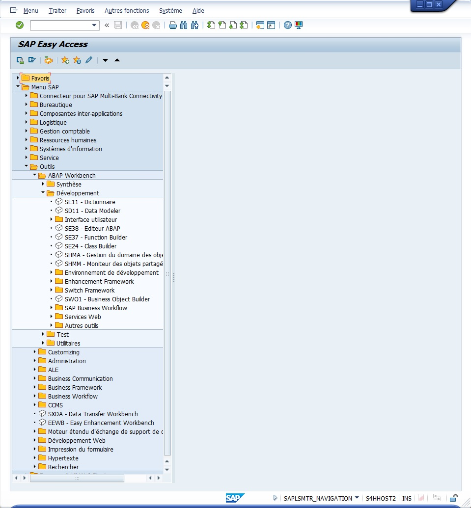
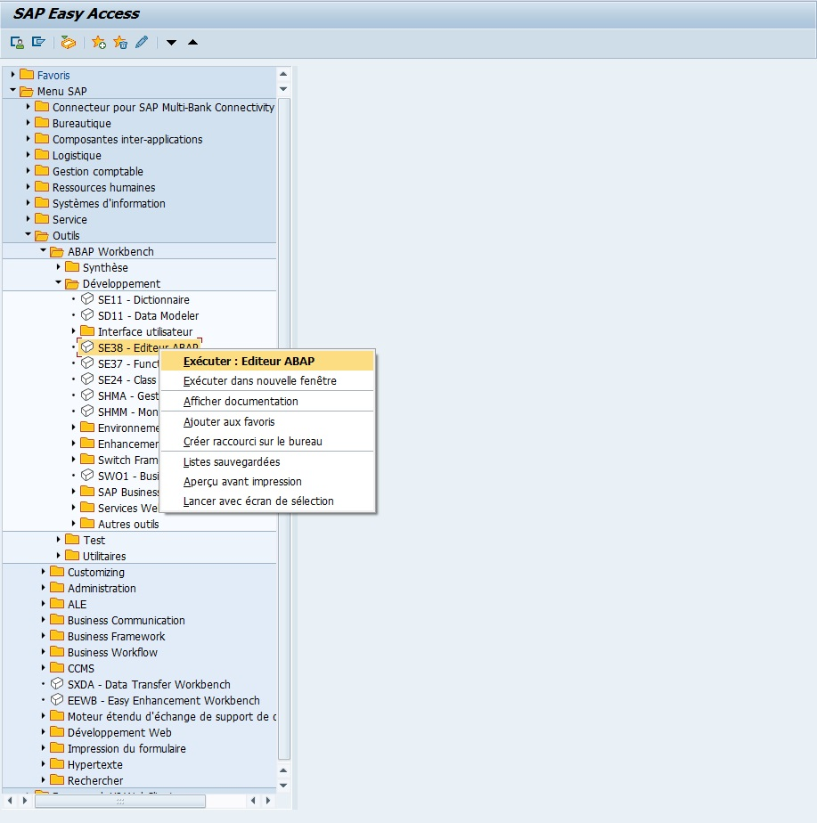
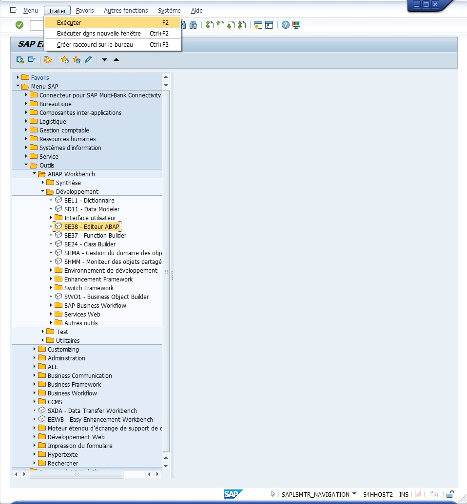
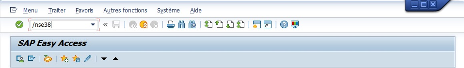

# TRANSACTIONS

Comme il a été évoqué dans la section précédente, une [TRANSACTION](../00_HELP/01_TCODES.md) (code de transaction ou [TCODE](../00_HELP/01_TCODES.md)) est un identifiant SAP pour exécuter divers traitements. Ils peuvent être de l’ordre d’une exécution de programme, de l’ouverture d’un éditeur, de la création d’une facture... Il existe des milliers de transactions et elles sont organisées par catégories correspondant aux modules (``FI``, ``SD``, ``MM``...) dont voici une toute petite liste des plus utilisées (uniquement les fonctionnelles) :

| ``T-CODE`` | TRANSACTION                                                       |
| ---------- | ----------------------------------------------------------------- |
| `SPRO`     | Transaction pour les fonctionnels (regroupement des paramétrages) |
| `MM01`     | Création de code produit                                          |
| `XD01`     | Création de client                                                |
| `XK01`     | Création de fournisseur                                           |
| `VA01`     | Création de commande client                                       |
| `ME21N`    | Création de commande d'achat                                      |
| `VL01N`    | Création d'une livraison                                          |
| `VF01`     | Création d'une facture                                            |
| `MIRO`     | Facture fournisseur                                               |
| `MIGO`     | Mouvement de stock                                                |
| `SCC1`     | Copie des données entre les mandants                              |

    En règle générale, les transactions se terminant par 01 signifient création, 02 modification et 03 affichage. Ainsi, la VA01 va créer une commande client, VA02 va la modifier et VA03 l’afficher.

Concernant les transactions techniques, il en existe bien évidemment plusieurs et celles qui seront utilisées dans ce livre se situent dans la partie ``Menu SAP - Outils - ABAP WORKBENCH - Développement``.

Les plus utilisées seront les suivantes :
s
| ``T-CODE``   | TRANSACTION                                                                                                                                          |
| ------------ | ---------------------------------------------------------------------------------------------------------------------------------------------------- |
| `SE38`       | Editeur ABAP                                                                                                                                         |
| `SE80`       | Editeur ABAP                                                                                                                                         |
| `SE11`       | [DDIC](../07_DDIC/01_DICTIONNAIRE_DE_DONNEES.md) - utilisé pour tout ce qui est création et gestion des [DBTAB](../08_DB_TABLES/02_TABLES.md), structures... |
| `SE37`       | Editeur de Fonctions                                                                                             |
| `SE24`       | Editeur de Classes                                                                                               |
| `SMARTFORMS` | Editeur de Smartforms                                                                                                                            |
| `SE41`       | Editeur de Menu (barre d'outils)                                                                                                                     |
| `SE51`       | Editeur d'Ecran                                                                                                                                      |
| `SE91`       | Gestion des Messages                                                                                             |
| `ST22`       | [DUMP](../06_DUMP/01_DUMP.md) listing                                                                                                     |
| `SE10`       | [ORDRES DE TRANSPORT](../02_PROGRAMMATION/02_CREATION_OT.md) listing                                                                                      |

Enfin, quelques_transactions Basis sont également à connaître pour débloquer certaines situations :

| ``t-code`` | TRANSACTION                                                                            |
| ---------- | -------------------------------------------------------------------------------------- |
| `SM04`     | User Listing                                                                           |
| `SM12`     | List of blocked entries                                                                |
| `STATS`    | Enregistre et analyse tous les processus lancés, et en cours pour un utilisateur donné |
| `SM37`     | Jobs listing                                       |
| `ST05`     | Trace toutes opérations de base de données lors d'une exécution de programme           |
| `STMS`     | Gestion des [ORDRES DE TRANSPORT](../02_PROGRAMMATION/02_CREATION_OT.md)                    |

Une transaction peut être appelée de plusieurs manières (exemple avec l’appel de l’éditeur ABAP `SE38`) :

- Via la fenêtre d’accueil, dans le menu SAP.

  - Par un double clic sur la ligne de l’éditeur.

  - En affichant les fonctions de l’item et en sélectionnant ``Exécuter``.

    

  - Avec le menu déroulant ``Traiter - Exécuter`` (ou Exécuter dans nouvelle fenêtre).

    

  - Via la zone de commande :

    - ``SE38`` (si l’on se trouve directement dans la fenêtre d’accueil).

    - ``/nSE38`` pour terminer la transaction en cours et en exécuter une nouvelle dans la même fenêtre.

    - ``/oSE38`` ou ``/*SE38`` pour ne pas terminer la transaction en cours et en exécuter une nouvelle dans une autre fenêtre.

    

        L’appel d’une transaction dans la zone de commande peut s’écrire en utilisant les majuscules ou les minuscules, il n’y a aucune incidence de casse.

Maintenant que l’éditeur ABAP est ouvert, il serait intéressant de s’attarder sur la présentation de cet écran pour ensuite programmer les premières lignes de code en_ABAP.
