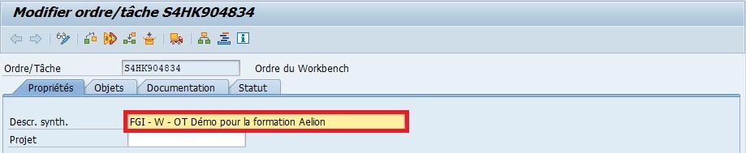

# CREATION D'UN ORDRE DE TRANSPORT

Sur SAP, un ``OT`` est une abréviation couramment utilisée pour désigner un ``Ordre de Transport``. Les ``ordres de transport`` sont des enregistrements dans le système SAP qui contiennent des objets à transporter d'un système SAP à un autre. Ces objets peuvent inclure des programmes, des rapports, des formulaires, des tables, des configurations et d'autres éléments développés ou modifiés dans un système SAP.
>
Les ``ordres de transport`` sont utilisés pour organiser et contrôler le transfert d'objets entre différents systèmes SAP, généralement entre des systèmes de développement, de test et de production. Ils permettent de garantir l'intégrité et la cohérence des objets SAP lorsqu'ils sont déployés dans différents environnements.

## CONVENTIONS

Lors de la création, renseigner le nom/description de l’OT en respectant les conventions de nommage du client concerné. Dans notre cas, on utilisera cette norme :

- FGI = Trigramme du développeur
- W = OT de Workbench
- Description du sujet à l’origine de cet OT

## CREATION

Aller dans la Transaction ``SE10``

1. Créer...

    

2. Sélectionner l'ordre (Workbench pour Tech) et valider.

    

3. Renseigner la Description synthétique obligatoire

    

4. (Optionnel) Si l'OT est affecté à un projet, vous pouvez le lier à ce dernier à cette étape.

5. Enregistrer

## VISUALISATION OT

Aller dans la Transaction ``SE10``

1. Entrer le créateur de l'OT désiré (ou * pour tout afficher)

    

2. Afficher

    

3. Visualiser

    

## COMPARAISON LES VERSIONS D'OBJETS D'UN OT

1. Double clic sur l'OT pour visualiser les objets.

    

2. Double clic sur l'objet à comparer.

    

3. Utilitaires Versions Gestion des versions

    

4. Sélectionner (avec ``CTRL``) les versions à comparer (mauvais exemple ici car il n'y a qu'une seule version)

    

5. Comparer

    

## MODIFICATION SUR UN OT

1. Créer un nouvel ``OT`` ou utiliser un ``OT`` spécifié préalablement.

2. Ouvrir l'objet à modifier dans la transaction adaptée (SE80, SE24, ...)

3. Enregsitrer et activer l'objet sous le nouvel OT.

## LIBERER UN OT

1. Pour chaque sous-objets de l'OT à libérer, sélectionner le (clique simple).

    

2. Libérer le sous-objet en cliquant sur l'icône.

    

3. Répéter pour chaque sous-objet de l'OT.

4. Enfin, sélectionner l'OT.

    

5. Libérer l'OT

    

6. La fenètre change et fera état de la progression du transport de l'OT.
    Il sera nécessaire parfois d'actualiser pour vérifier que le transport progresse et se termine correctement.

Après avoir été libéré, l’OT va suivre un certainement "cheminement" (passage sur le système de qualification, validation par les fonctionnels etc…). Ce cheminement sera défini par un package (classe de développement) qui doit être renseigné car il spécifie une route de transport et permet d’organiser et de regrouper les différents développements.

Exemples :

- ZFR pour tous les programmes d’un pays en particulier.

- ZX pour tous les objets relatifs à un projet X

- ZSD pour tous les objets relatifs au module SD
