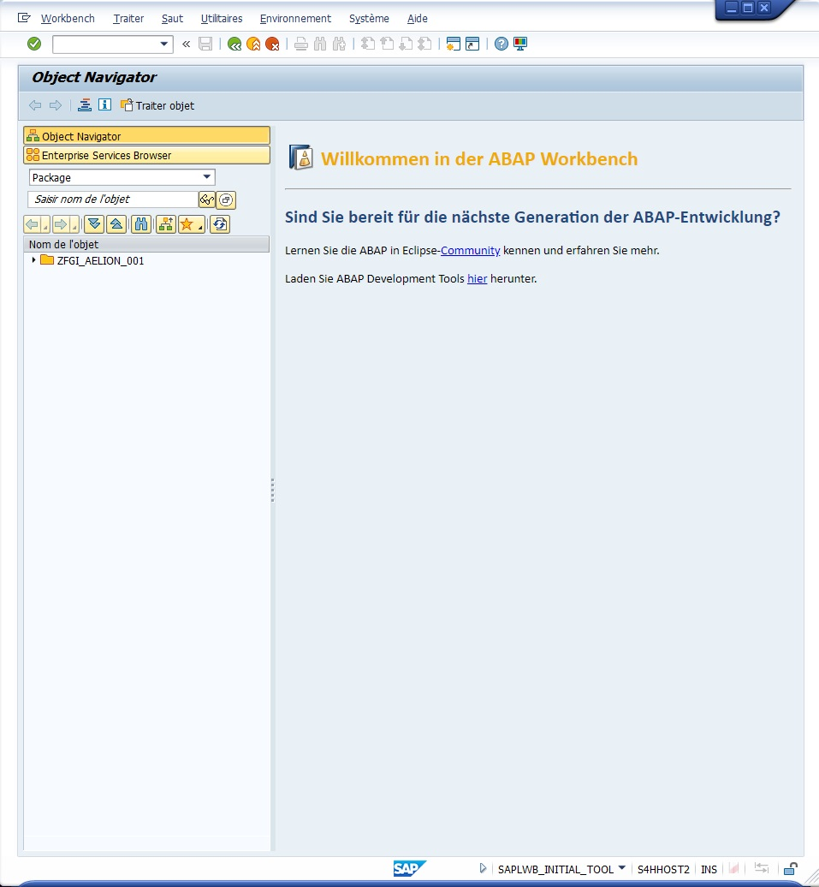
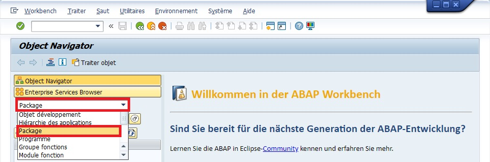
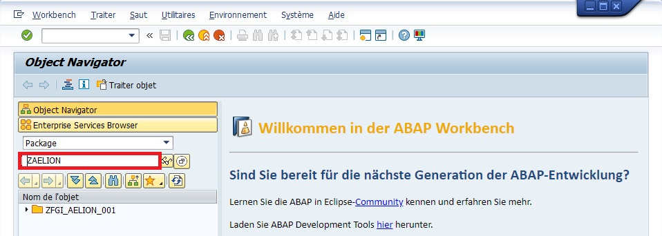
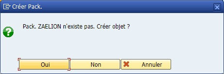
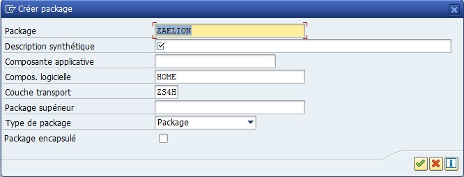
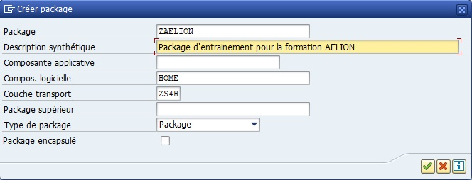
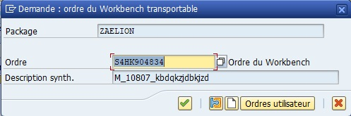

# CREATION D'UN PACKAGE

Un ``package`` ou ``Classe de Développement`` :

- représente un ensemble de développements.

- sert de critère de recherche dans le workbench.

- est indispensable si l’on veut pouvoir transporter le programme du système de développement au système de production.

N.B.: La classe de développement $TMP est associée aux programmes "jetables". Ces programmes ne pourront jamais être transportés sur le système de production .

## PACKAGE OU OBJET LOCALE

Lors d'une mission, il sera nécessaire d'identifier quel package utiliser. Hors de mission et dans le cadre d'entraînement, il sera préférable d'enregistrer un programme en tant qu'``Objet Locale`` (Package ``$TMP``).

## CREATION

### SE21

Suivre la procédure officielle SAP : [Creating the Main Package](https://help.sap.com/docs/SAP_NETWEAVER_700/12aa7f056c531014aa5bca7aee037e55/eac05d8cf01011d3964000a0c94260a5.html?locale=en-US&version=7.0.37).

### SE80

Aller dans la Transaction ``SE80``

1. Sélectionner ``Package``...

     

2. Entrer un nom de ``Package`` en commençant par ``Z``.

    

3. Appuyer sur Entrée. Une fenêtre popup s'ouvrira et vous demandera confirmation. Cliquer sur Oui.

    

4. Une seconde fenêtre popup s'ouvrira et vous demandera de renseigner des informations

    

4. Renseigner la description et les éventuelles autres informations précisées dans la spécification fonctionnelle, puis Valider.

    

5. Renseigner l'``OT`` sur lequel le package va être lié, puis valider.

    
