# CREATION D'UN PROGRAMME

Transaction ``SE38``

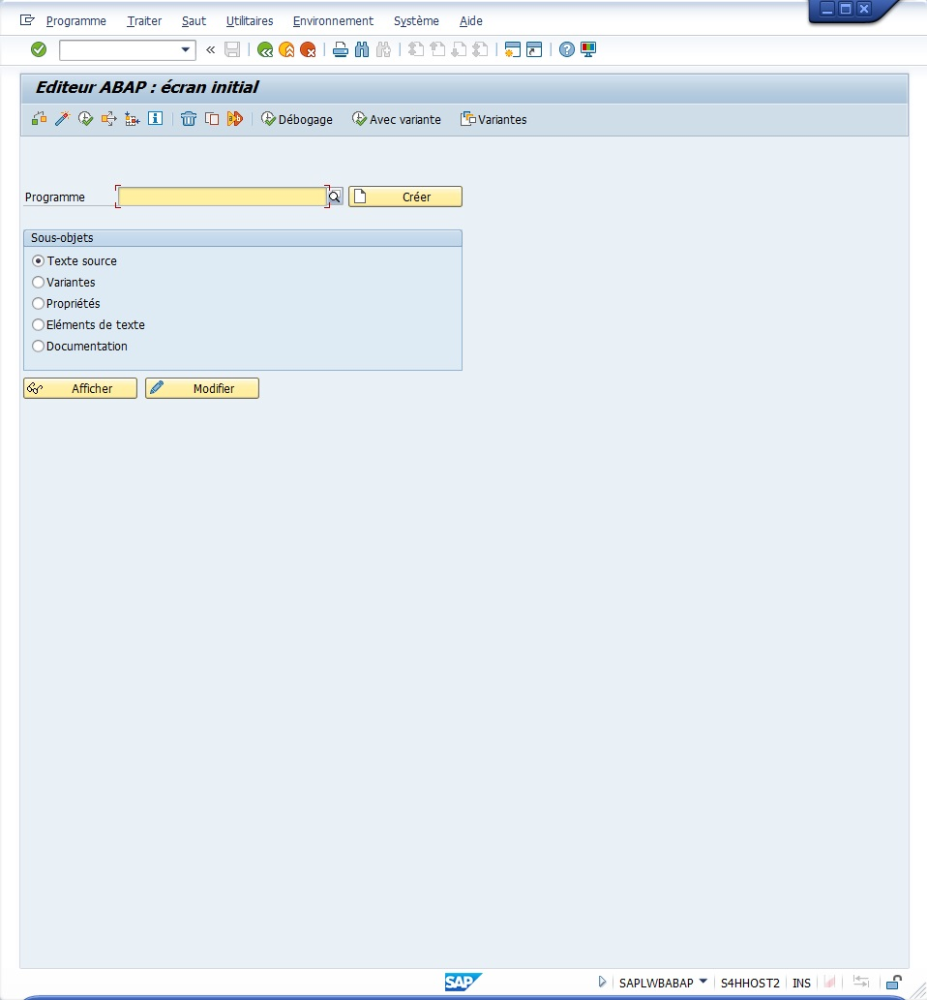

## FONCTIONNALITES SE38


- ``Contrôler`` (Programme -> Contrôler -> Syntaxe ou [ Ctrl ] + [ F2 ])
     
     Le programme et vérifier qu’il n’y ait pas d’erreur de syntaxe. Il est à noter plusieurs contrôles existants, dont les principaux sont :

  - ``Contrôle basique`` (dit de syntaxe)

  - ``Contrôle de programme étendu`` (ou via la transaction SLIN) qui permet une vérification plus poussée (chaînes de caractères, instructions obsolètes...)

  - ``Code Inspector`` vérifiera quant à lui la performance du programme, la sécurité...

- ``Activer`` (Programme -> Activer ou [ Shift ] + [ F9 ])

     Le programme (ou le compiler, terme utilisé dans d’autres langages de programmation), le rendant ainsi exécutable et donc prêt à être testé.

- ``Exécuter`` (Programme -> Exécuter -> Directement ou [ F8 ])

     Le programme et donc le tester. Là aussi il existe une autre option consistant à exécuter un programme en arrière-plan (à planifier ou immédiatement) ce qui signifie que celui-ci sera traité par un job dont le résultat sera disponible grâce à la Transaction SM37.

- ``Cas d’emploi`` (Utilitaires -> Cas d’emploi ou [ Ctrl ] + [ Shift ] + [ F3 ])

     Sert à lister tous les objets utilisant ce programme que ce soit par appel, par référence...

  
- ``Analyse de l’environnement`` (Utilitaires -> Analyse de l’environnement ou [ Shift ] + [ F4 ])

     Liste les objets utilisés par le programme. Il peut s’agir de Classe, d’[ELEMENTS DE DONNEES](../07_DDIC/05_ELEMENTS_DE_DONNEES.md), de [STRUCTURES](../07_DDIC/06_STRUCTURES.md)...

  

- ``Supprimer`` (Programme -> Supprimer... ou [ Shift ] + [ F2 ])

- ``Copier`` (Programme -> Copier... ou [ Ctrl ] + [ F5 ])

- ``Renommer`` (Programme -> Renommer... ou [ Ctrl ] + [ F6 ])

- ``Débogage`` (Programme -> Exécuter -> Débogage ou [ Shift ] + [ F5 ])

     Exécutera le programme en mode débugger

- ``Exécution avec variante`` (Programme -> Exécuter -> Avec variante ou [ Shift ] + [ F6 ])

     Une variante est un procédé permettant d’enregistrer les valeurs d’un écran de sélection.

- ``Variantes`` (Saut -> Variantes ou [ Ctrl ] + [ F1 ])

     Utilisée pour créer ledit procédé.

## INTERFACE

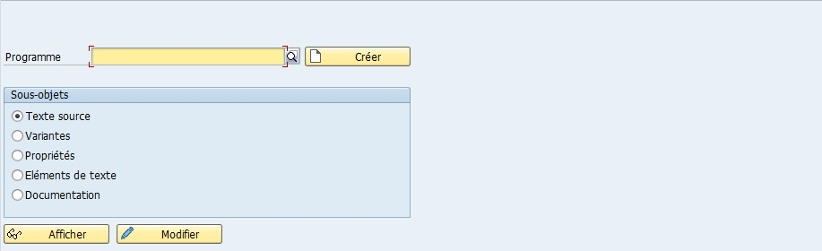

- ``Texte Source`` pour modifier le code source.

- ``Variantes`` pour modifier la ou les variantes associées au programme.

- ``Propriétés`` (développé tout de suite après lors de la création du programme).

- ``Documentation``

- ``Éléments de texte`` : regroupe tous les messages, textes... du programme.

      

## CONVENTIONS

Pour les développements spécifiques ABAP, tous les objets doivent toujours commencer par Z ou Y. Le système SAP bloque toute tentative ne respectant pas cette règle.

## CREATION

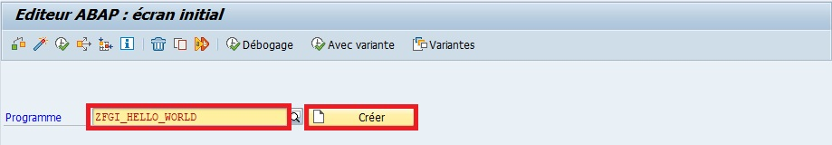

    Lors de la création du programme ZFGI_HELLO_WORLD, une fenêtre des propriétés du programme apparaît. Plusieurs éléments sont obligatoires, à commencer par le titre (quelconque, pour cet exemple, celui de HELLO WORLD sera choisi).

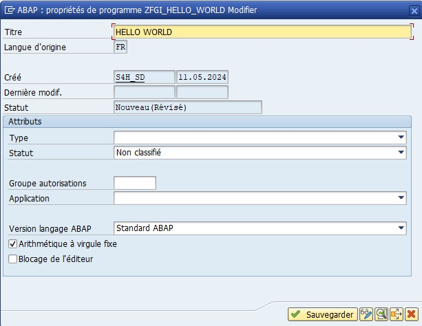

### ATTRIBUTS

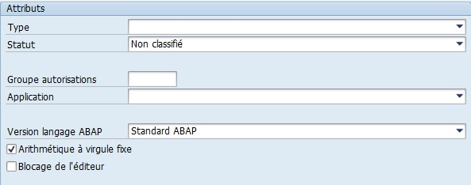

#### ATTRIBUT TYPE

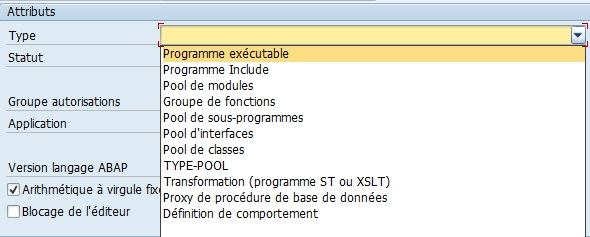

    Comme le programme à créer est simple et vise à être exécuté directement via TRANSACTION ou éditeur ABAP, le type exécutable sera choisi.

Il existe bien évidemment plusieurs types de programme à savoir :

- Programme exécutable (1) :

     défini comme Report (voir écran suivant) qui peut être appelé directement à partir d’une [TRANSACTION](./03_Transactions.md), via l’éditeur ABAP (Transaction SE38) ou par un programme externe.

- Programme Include (I) :

     défini comme `INCLUDE`, contient les Routines ou les déclarations des [VARIABLES](../03_VARIABLES_&_CONSTANTES/02_VARIABLES_&_CONSTANTES/01_VARIABLES.md) d’un programme principal. Il est utilisé une fois qu’il a été déclaré via la syntaxe Include.

- Pool de Modules (M) : 

     définit `PROGRAM`, utilisé lorsqu’un programme peut être composé de plusieurs écrans complexes (un écran principal, un écran résultat, un sous-écran détail...) et ne peut être exécuté qu’à partir d’une [TRANSACTION](./01_TRANSACTIONS.md) (impossible de l’éxécuter directement via l’éditeur ABAP, comme dans la majorité des cas).

- Groupe de fonctions (F) : 

     définit `GROUP FUNCTION`, permet de regrouper plusieurs Modules fonction sous un programme principal.

- Pool de sous-programmes (S) : 

     définit `POOL SS-PROGR.`, contient des Routines de programmes (`FORM`) pouvant être appelées par un programme externe.

- Pool d’interfaces (J) : 

     définit le programme comme interface ABAP.

- Pool de classes (K) : 

     définit cette fois-ci le programme comme Classe ABAP.

- TYPE-POOL (T) : 

     contient des déclarations de [VARIABLES](../03_VARIABLES_&_CONSTANTES/02_VARIABLES_&_CONSTANTES/01_VARIABLES.md) de type `TYPES` pouvant être appelées par un programme externe.

- Transformation (Programme ST ou XSLT (X)) : 

     permet de lire et/ou de créer des fichiers au format _XML_.

- Proxy de procédure de base de données (Q).

#### ATTRIBUTS STATUT, APPLICATION & GROUPE AUTORISATION

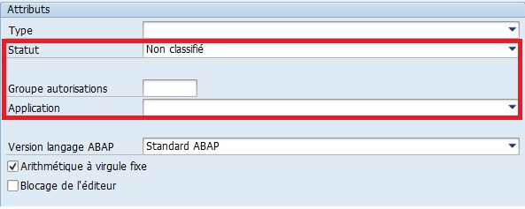

N’étant pas obligatoires et assez peu utilisés, il n’est pas nécessaire de s’y attarder mais en résumé :

- Statut :

     permet de définir de quel genre de programme il s’agit (programme test, système ou pour la production)

- Application : 

     permet de le catégoriser (gestion des articles, comptabilité analytique...)

- Groupe d’autorisations :

     comme son nom l’indique, authentifie l’_utilisateur_ exécutant le programme afin de vérifier qu’il ait bien les _permissions_ requises pour effectuer cette tâche.

#### ATTRIBUTS NOM BD LOGIQUE & EXRAN DE SELECTION

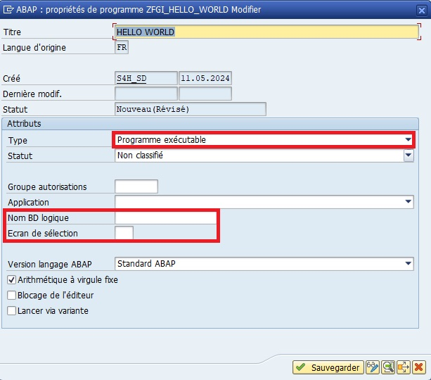

Après avoir sélectionner "Programme exécutable", deux autres options supplémentaires sont apparues :

- Nom BD logique

     contient tout un groupe d’objets (allant de déclarations de [VARIABLES](../03_VARIABLES_&_CONSTANTES/02_VARIABLES_&_CONSTANTES/01_VARIABLES.md), d’include jusqu’aux écrans de sélection)

- Ecran de sélection 

     pour choisir celui de la BD logique à utiliser.

Comme pour les options précédentes, elles seront laissées à blanc.

#### ATTRIBUTS OPTIONS

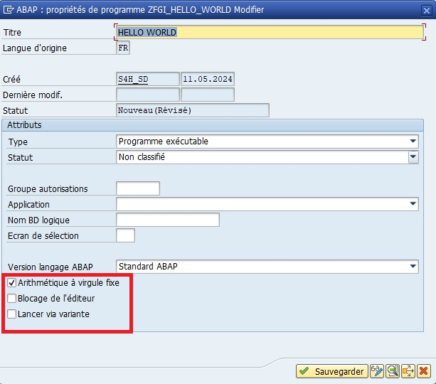

- Option Blocage de l’éditeur 

     doit être décochée (sinon il serait impossible pour d’autres développeurs de modifier ce programme).

- Option Arithmétique à virgule fixe 

     doit rester cochée (cette dernière option contraindrait le développeur à n’utiliser que des nombres entiers).

### SAUVEGARDER

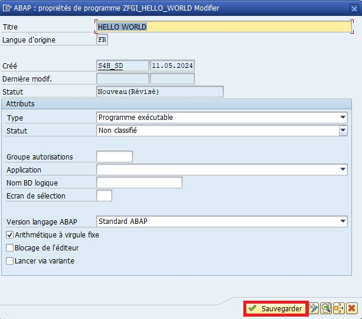

Une fois toutes les propriétés du programme renseignées, et après avoir cliqué sur ``Sauvegarder``, une nouvelle fenêtre apparaît. Cette fois-ci, il sera nécessaire de définir si le programme a pour vocation de rester en local ou s’il devra être transporté dans les systèmes du projet.

- Si le programme est voué à être un test, il sera nécessaire de renseigner le champ Package comme suivant et de cliquer sur ``Objet local``.

     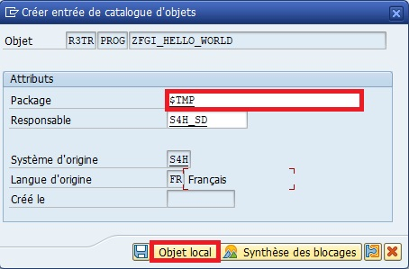

     Il ne sera alors pas nécessaire d'attribuer un OT pour ce programme car il serait enregistrer en tant qu'objet locale et sera temporaire (package $TMP).

- Sinon, renseigné le package sur lequel le programme doit appartenir et cliquer sur ``Sauvegarder``.

     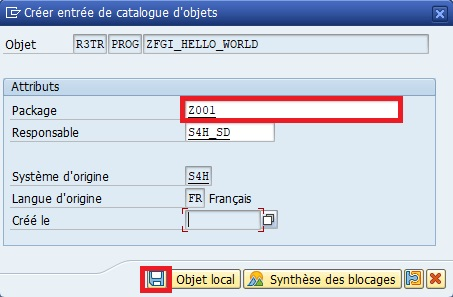

     Il sera alors nécessaire d'attribuer un OT sur lequel transferrer le programme.

     - Soit en le créant directement : 

          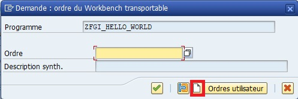

          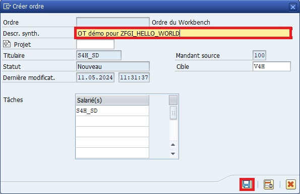

          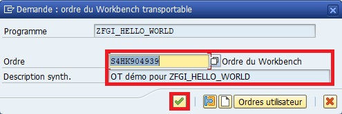

     - Soit en le sélectionnant s'il existe déjà :

          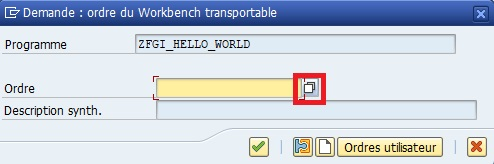

          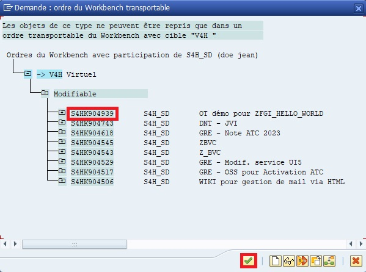

          

## EDITEUR ABAP

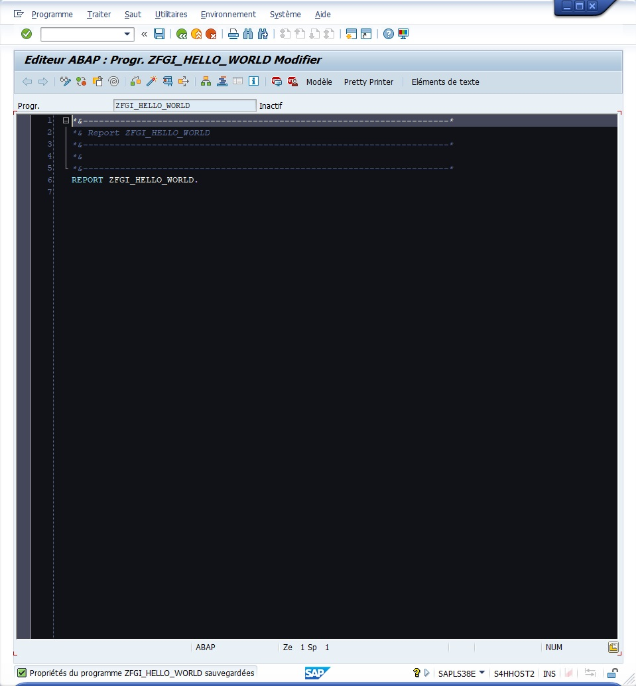

Maintenant que le programme a été créé, l’_éditeur ABAP_ est ouvert en mode modification. Les premières lignes sont caractérisées par le [CARTOUCHE](../03_VARIABLES_&_CONSTANTES/01_CARTOUCHE_&_COMMENTAIRES/02_CARTOUCHE.md) du programme.

```abap
*&---------------------------------------------------------------------*
*& Report ZFGI_HELLO_WORLD
*&---------------------------------------------------------------------*
*&
*&---------------------------------------------------------------------*
```

### NAVIGATION DANS L'EDITEUR


- ``Ecran précédent`` ([ Shift]`` + ``[ F6 ]) 

- ``Ecran suivant`` ([ Shift ] + [ F7 ])

- ``Afficher <-> Modifier`` (Programme -> Afficher <-> Modifier ou [ Ctrl ] + [ F1 ])

     bascule entre les deux modes sans qu’il y ait besoin de repasser par l’écran d’accueil de l’éditeur.

- ``Actif <-> Inactif`` (Programme -> Actif <-> Inactif ou [ Shift ] + [ F8 ]) 

     bascule quant à lui entre les modes _actif_ ou _inactif_. S’il est en cours de développement, le mode _actif_ affichera la dernière version active du programme.

- ``Autre objet...`` (Programme -> Autre objet... ou [ Shift ] + [ F5 ])

     utilisé pour ouvrir un nouveau programme sans repasser par l’écran d’accueil de l’éditeur.

- ``Étendre`` (Programme -> Étendre ou [ Shift ] + [ F4 ])

     connu aussi en anglais sous `Enhancement Point`, il s’agit d’insérer des lignes de code dans les programmes standards. Ceux-ci étant totalement bloqués pour modification, SAP a néanmoins laissé des espaces utilisables pour apporter quelques modifications ou précisions.

- ``Contrôler``

- ``Activer``

- ``Exécution directe`` (Programme -> Exécuter -> Direct ou [ F8 ]``)

     même fonction que le bouton Exécuter de l’écran d’accueil de l’éditeur ABAP.

- ``Cas d’emploi``

- ``Afficher liste d’objets`` (Utilitaires -> Afficher liste d’objets ou [ Ctrl ] + [ Shift ] + [ F5 ])

     ouvre un panneau à gauche de l’écran en listant tous les objets liés au programme : Includes,Routines, [TRANSACTIONS](./01_TRANSACTIONS.md)...

- ``Afficher fenêtre de navigation`` (Utilitaires -> Afficher fenêtre de navigation ou [ Ctrl ] + [ Shift ] + [ F4 ])

     ouvre une petite fenêtre en bas de l’écran avec tous les derniers objets consultés facilitant ainsi la navigation entre ces derniers.

- ``Activer/désactiver plein écran`` 

     affiche ou masque les deux dernières fonctionnalités (non existant dans les menus déroulants).

- ``Aide à... `` (Utilitaires -> Aide à ou [ Ctrl ] + [ F8 ])

     affiche une aide SAP très complète.

- ``Définir/supprimer point d’arrêt session`` (Utilitaires -> Points d’arrêt -> Activer/Supprimer ou [ Ctrl ] + [ Shift ] + [ F12 ])

     après avoir sélectionné une ligne puis cette option, une petite icône panneau `STOP` apparaît sur le côté gauche de la ligne. Lorsque le programme s’exécutera et qu’il arrivera à cette ligne marquée, il s’arrêtera pour ouvrir le `DEBUGGER`.

- ``Définir/supprimer point d’arrêt externe`` (Utilitaires -> Points d’arrêt utilisateur -> Activer/Supprimer point d’arrêt externe ou [ Ctrl ]` + [ Shift ] + [ F9 ]`)

     fonctionne de la même façon que le `POINT D'ARRET` session sauf qu’il s’agit ici d’un programme externe. Par exemple, lorsque SAP fonctionne sous Internet avec SAP portal, en arrière-plan, des programmes sous SAP sont exécutés. Dans ce cas-ci, si le programme doit être analysé en mode Debbogage, il sera nécessaire d’utiliser des Point d'arrêt externes.

- ``Modèle`` (Traiter -> Modèle ou [ Ctrl ] + [ F6 ])

     est une aide pour certains objets ABAP (Fonctions, Classe, Méthodes, [MESSAGES](../03_VARIABLES_&_CONSTANTES/02_VARIABLES_&_CONSTANTES/06_INSTRUCTION_MESSAGE.md)...), pour afficher les `PARAMETRES D'ENTREE`, de `SORTIE`, de `TABLES`, `OBLIGATORY` ou `OPTIONAL`, écrire une syntaxe correctement...

- ``Pretty Printer`` 

     est un outil très utile pour la mise en forme du programme en alignant les Instructions conditionnelles, en mettant en majuscules les mots-clés... le rendant ainsi beaucoup plus clair et lisible.
