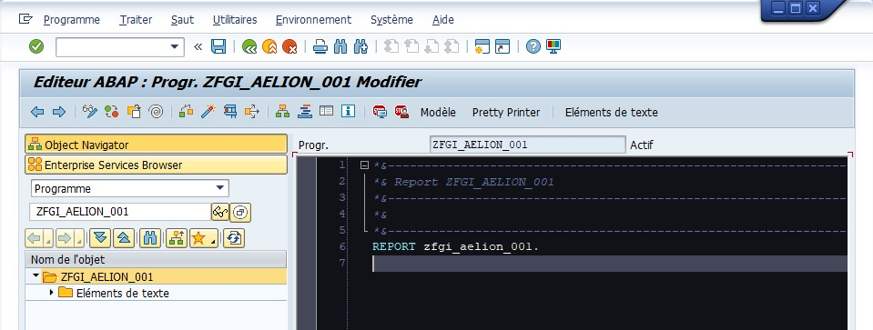
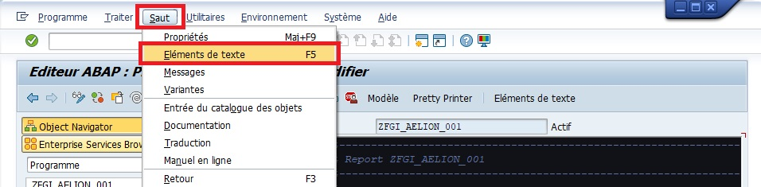

# MESSAGES

## MESSAGE ...

```abap
"Message type informatif (popup)
MESSAGE 'Ceci est un message informatif.' TYPE 'I'.
```

```abap
"Message type Warning (message rouge en bas à gauche)
MESSAGE 'Attention : Opération risquée !' TYPE 'W'.
```

```abap
"Message type Error (message rouge en bas à gauche type BLOQUANT)
MESSAGE 'Erreur : Opération impossible.' TYPE 'E'.
```

```abap
"Message type Success (message vert en bas à gauche)
MESSAGE 'Succés.' TYPE 'S'.
```

## ... DISPLAY LIKE ...

```abap
MESSAGE 'Ceci est un message informatif.' TYPE 'I' DISPLAY LIKE 'S'.
```

```abap
MESSAGE 'Attention : Opération risquée !' TYPE 'W' DISPLAY LIKE 'E'.
```

```abap
MESSAGE 'Erreur : Opération impossible.' TYPE 'E' DISPLAY LIKE 'W'.
```

```abap
MESSAGE 'Succés.' TYPE 'S' DISPLAY LIKE 'I'.
```

## MESSAGE ELEMENTS DE TEXTE

1. Dans un programme modifiable

      

2. Aller dans [ Saut ], puis [ Eléments de texte ]

      

3. Aller dans l'onglet [ Symboles de texte ], puis renseigner le numéro du message ainsi que son contenu.

      

4. Appuyer sur Entrée.

      

5. Enregistrer et activer.

      

      

7. [ Retour arrière ]

      

8. Dans le programme, après l'instruction ``START-OF-SELECTION``, entrer l'instruction suivante :

      

      ```abap
      START-OF-SELECTION.

          MESSAGE TEXT-001 TYPE 'I'.
      ```

9. [ Activer ] et [ Exécuter ]

      
