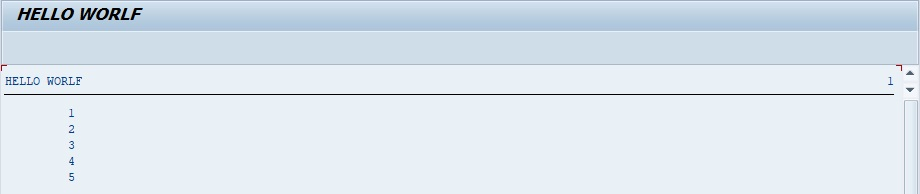

# DO ENDDO

```abap
DO [n TIMES].
  [statement_block]
ENDDO.
```

Une boucle en programmation est un processus permettant de répéter une opération autant de fois que nécessaire. En `ABAP` il en existe trois au total dont la première est le `DO… ENDDO`.

L’option `n TIMES` permet de définir combien de fois la boucle doit être répétée.

```abap
DO 5 TIMES.
  WRITE:/ SY-INDEX.
ENDDO.
```

La [VARIABLE SYSTEME SY-INDEX](../00_HELP/02_SY_SYSTEM.md) est un compteur et indique donc combien de fois la boucle a été exécutée. Ainsi le `DO` a été paramétré pour être exécuté cinq fois et à chaque fois, le [SY-INDEX](../00_HELP/02_SY_SYSTEM.md) est affiché. Le résultat final sera le suivant :



Il est très important de toujours définir une sortie à une boucle au risque de créer une `boucle infinie`. Dans cet exemple l’option `n TIMES` a été utilisée, mais il est également possible d’utiliser des instructions comme `EXIT`.

Ainsi en reprenant l’exemple ci-dessus, mais sans l’utilisation de `n TIMES` :

```abap
DO.
  IF SY-INDEX > 5.
    EXIT.
  ENDIF.
  WRITE:/ SY-INDEX.
ENDDO.
```

La boucle est appelée mais sans paramètre de sortie défini au préalable, une première condition va vérifier si le [SY-INDEX](../00_HELP/02_SY_SYSTEM.md) est strictement supérieure à `5` : si oui alors le programme sortira de la boucle `EXIT`, sinon, il n’entrera pas dans cette condition et affichera la valeur de [SY-INDEX](../00_HELP/02_SY_SYSTEM.md) à l’écran.

À noter qu’il aurait été possible également d’utiliser un `ELSE` sans qu’il n’y ait de changement dans le résultat :

```abap
DO.
  IF SY-INDEX > 5.
    EXIT.
  ELSE.
    WRITE:/ SY-INDEX.
  ENDIF.
ENDDO.
```
