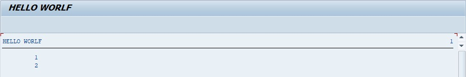
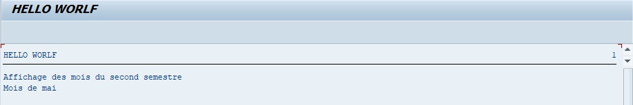

# CHECK

```abap
DO 5 TIMES.
  CHECK SY-INDEX < 3.
  WRITE / SY-INDEX.
ENDDO.
```

Le `CHECK` est une condition comparant l’état d’une [VARIABLE](/03_VARIABLES_&_CONSTANTES/02_VARIABLES_&_CONSTANTES/01_VARIABLES.md avec une autre. Si la condition est vraie alors le programme continue sinon il sort du traitement :

La boucle est initialisée pour être exécutée cinq fois. Un `CHECK` vérifiera si le [SY-INDEX](../00_HELP/02_SY_SYSTEM.md) est strictement inférieure à `3`, si oui alors elle sera affichée, sinon le programme passera à la ligne suivante.



Dans le résultat, les valeurs 1 et 2 sont affichées et comme le reste (3, 4 et 5) n’a pas été validé par le `CHECK`, alors il a été mis de côté.

    Le CHECK peut très bien être comparé au IF... ENDIF et peut tout aussi bien être utilisé tel quel, hors d’une boucle :

Exemple de l’utilisation du `CHECK` hors d’une boucle

```abap
DATA: lv_month TYPE i.

lv_month = SY-DATUM+4(2).

CHECK lv_month <= 6.

WRITE:/ 'Affichage des mois du second semestre'.

CASE lv_month.
  WHEN 1.
    WRITE:/'Mois de janvier'.
  WHEN 2.
    WRITE:/'Mois de février'.
  WHEN 3.
    WRITE:/'Mois de mars'.
  WHEN 4.
    WRITE:/'Mois de d''avril'.
  WHEN 5.
    WRITE:/'Mois de mai'.
  WHEN 6.
    WRITE:/'Mois de juin'.
  WHEN 7.
   WRITE:/'Mois de juillet'.
ENDCASE.
```

Le programme va tout d’abord commencer par vérifier que le mois en cours est supérieur ou égal à `6`, puis avec un `CASE`, il affichera le mois en cours.


