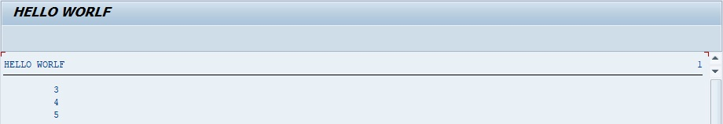

# CONTINUE

Le `CONTINUE` a un fonctionnement bien différent. Il est souvent utilisé dans une condition `IF` et si celle-ci est validée, alors le `CONTINUE` arrêtera le traitement pour passer à la ligne suivante.

Exemple

```abap
DO 5 TIMES.
  IF SY-INDEX < 3.
    CONTINUE.
  ENDIF.
  WRITE / SY-INDEX.
ENDDO.
```

La boucle `DO` est configurée pour être exécutée cinq fois. Une condition va tester si la valeur du [SY-INDEX](../00_HELP/02_SY_SYSTEM.md) est strictement inférieure à `3`. Si oui, alors le traitement de la ligne est arrêté pour passer à la suivante (`CONTINUE`) sinon il affichera [SY-INDEX](../00_HELP/02_SY_SYSTEM.md).



Les valeurs `1` et `2` étant strictement inférieures à `3`, ne seront pas affichées par le `WRITE` alors que le reste le sera.
