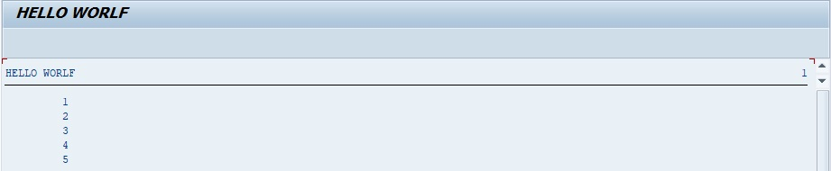

# WHILE ENDWHILE

```abap
WHILE log_exp.
  [statement_block]
ENDWHILE.
```

Le `WHILE` a le même comportement que le [DO](./01_DO_ENDDO.md) sauf que le paramètre de sortie est cette fois obligatoire (`WHILE log_exp`).

En reprenant le même exemple que le [DO](./01_DO_ENDDO.md), à savoir, boucler cinq fois et afficher le [SY-INDEX](../00_HELP/02_SY_SYSTEM.md), le programme ressemblera à ceci :

```abap
WHILE SY-INDEX <= 5.
  WRITE:/ SY-INDEX.
ENDWHILE.
```

`WHILE` pouvant être traduit par `tant que`, ce code peut être littéralement traduit par « tant que le [SY-INDEX](../00_HELP/02_SY_SYSTEM.md) est inférieure ou égal à `5`, afficher sa valeur ». Le résultat à l’écran sera le même que pour le [DO](./01_DO_ENDDO.md).



    Les options utilisées avec le DO peuvent très bien servir pour le WHILE, à savoir CHECK, CONTINUE et EXIT (pouvant être utilisé dans des cas particuliers même si la condition de sortie de boucle du WHILE est prédéfinie).
