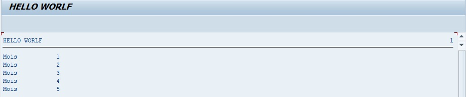

# WHILE EXIT

```abap
DATA: lv_month TYPE I.

lv_month = SY-DATUM+4(2).

WHILE SY-INDEX <= 12.
  IF SY-INDEX > lv_month.
    EXIT.
  ENDIF.
  WRITE:/'Mois ', SY-INDEX.
ENDWHILE.
```

La boucle a été définie pour être exécutée tant que le [SY-INDEX](../00_HELP/02_SY_SYSTEM.md) est inférieure ou égale à `12`. Si la valeur du [SY-INDEX](../00_HELP/02_SY_SYSTEM.md) est strictement supérieure au mois en cours (`V_MONTH` défini au préalable via le [SY-DATUM](../00_HELP/02_SY_SYSTEM.md)), alors le programme sort de la boucle, sinon il affichera le message `Mois` et la valeur de [SY-INDEX](../00_HELP/02_SY_SYSTEM.md).


