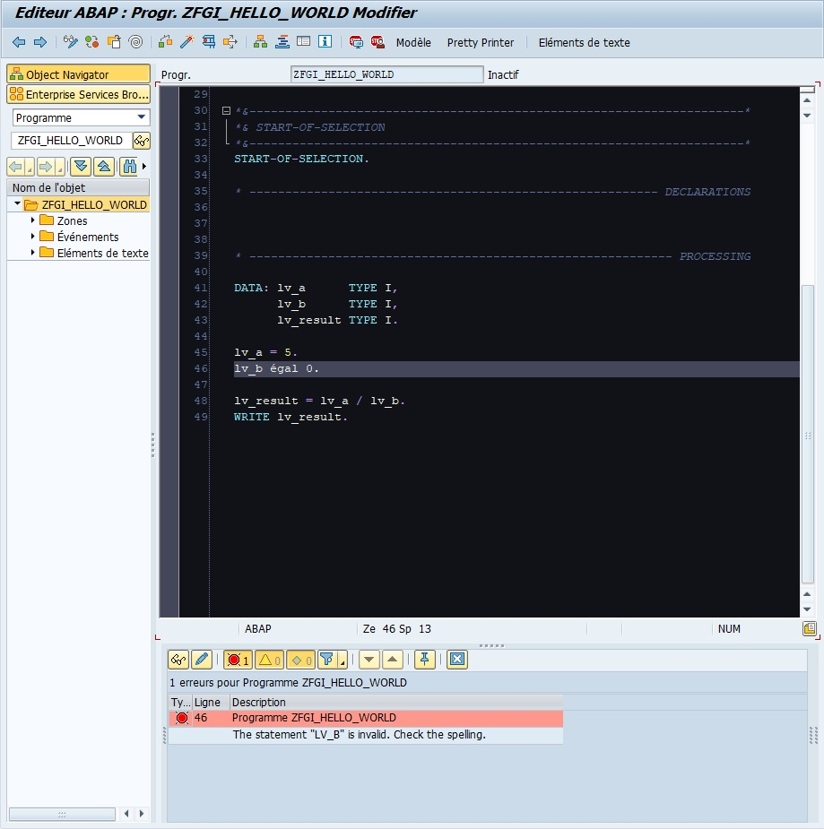
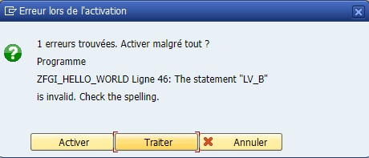
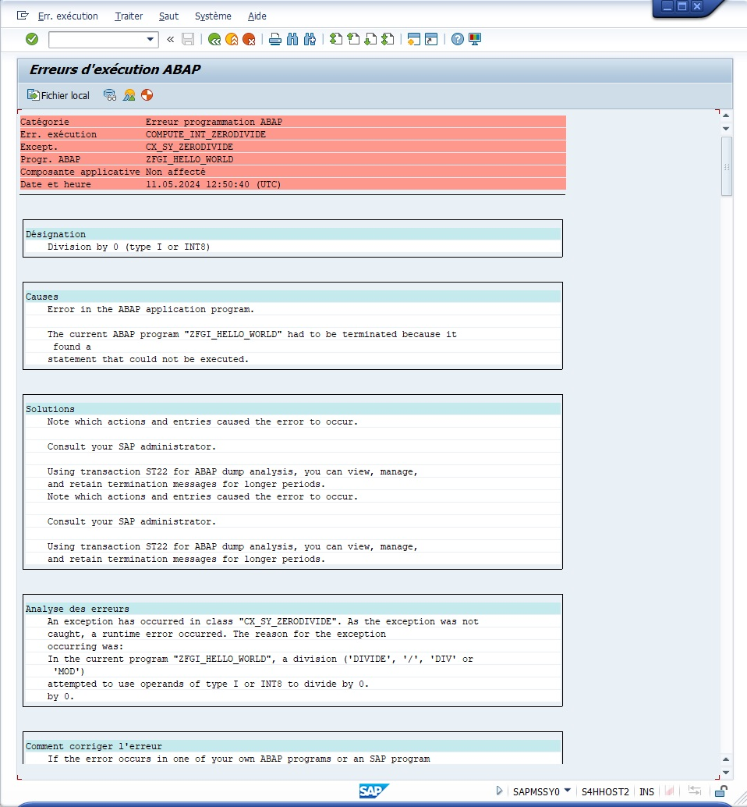
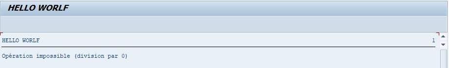

# DUMP

Dans l’éditeur `ABAP`, il a été vu qu’il était possible de contrôler le programme afin de s’assurer qu’il ne comporte pas d’erreurs de syntaxe comme dans l’exemple qui suit :

```abap
DATA: lv_a      TYPE I,
      lv_b      TYPE I,
      lv_result TYPE I.

lv_a = 5.
lv_b égal 0.

V_RESULT = lv_a / lv_b.
WRITE lv_result.
```

Le mot `égal` a été délibérément écrit ainsi. Une fois ces lignes insérées, le programme est sauvé puis contrôlé. Une liste d’erreurs et/ou de `warning` apparaît en bas de l’écran.



En double cliquant sur la ligne de description, l’éditeur va automatiquement se rendre au niveau du code avec un problème pour correction. Il est possible de tenter également d’activer le programme, mais cette fois, une fenêtre pop-up est affichée avec trois options possibles :



    1. `Activer` et donc ne pas tenir compte des erreurs, et continuer l’activation.

    2. `Traiter` pour afficher les erreurs en bas de l’écran comme lors du Contrôle.

    3. `Interrompre` pour terminer le processus d’activation.

Bien évidemment, l’option `Activer`, alors qu’il existe une erreur, est à bannir, elle ne doit jamais être choisie, excepté en de très rares occasions. Il faut à ce moment-là choisir Traiter et corriger ce qui ne va pas.

La ligne défectueuse est corrigée en remplaçant le mot `égal` par `EQ` ou `=`.

```abap
V_B = 0.
```

Le programme est de nouveau sauvegardé, puis contrôlé. Il est syntaxiquement correct et va être activé puis exécuté. Bien évidemment, le dump suivant surgit.



- `En-tête` avec la catégorie du dump

    un code système d’erreur (COMPUTE*INT_ZERODIVIDE dans ce cas), la classe d’exception rencontrée par le noyau SAP pendant l’exécution du programme (CX_SY_ZERODIVIDE), le nom du programme ayant causé ce dump, la date et l’heure.

- `Désignation` 

    affiche un bref descriptif de l’erreur.

- `Causes`

    pourquoi SAP retourne cette erreur.

- `Solutions`

    indique très succinctement les personnes à prévenir (ici le développeur).

- `Analyse des erreurs`

    décrit l’erreur rencontrée par SAP avec un peu plus de précisions système.

- `Comment corriger l’erreur` (pour les personnes citées dans la partie Solutions) 

    indique ici que faire, par exemple, nous inviter à vérifier si SAP n’a pas un correctif s’il s’agit d’un programme standard (correctif appelé note OSS), ou bien, toujours dans le cas d’un programme standard, comment faire pour signaler cette erreur à SAP et quelles informations doivent être mises en avant...

- `Environnement système` 

    est une liste technique regroupant tout le détail du système SAP : nom du serveur, nom de la Base de données, adresse IP, numéro d’installation SAP, nom du système de connexion...

- `Utilis. et transaction` 

    regroupe les informations relatives au programme SAP : son nom, la [TRANSACTION](../02_PROGRAMMATION/01_TRANSACTIONS.md) appelée, le numéro d’écran...

- `Infos sur point d’interruption`

    donne une précision sur l’endroit du programme, et l’événement lors duquel cela s’est produit.

- `Extrait code source`
    
    affiche les lignes du programme avec l’indication `>>>>>` sur la ligne avec erreur.

- `Contenu zones systèmes`

    affiche la table [SY](../00_HELP/02_SY_SYSTEM.md).

- `Appels/Événements actifs`

    liste tous les programmes avant que le dump surgisse. Dans ce cas, c’est assez simple, mais parfois pour des [TRANSACTIONS](../02_PROGRAMMATION/01_TRANSACTIONS.md) complexes (`MIGO`, `VA01`...) plusieurs programmes standards sont appelés et cette liste aide bien à savoir où localiser le problème et à quel niveau.

- `Variables sélectionnées` 

    sont des [VARIABLES SYSTEME](../00_HELP/02_SY_SYSTEM.md) actives avant le dump.

- `Remarq. Internes`

    situe à quel niveau du noyau SAP (SAP kernel) l’erreur s’est produite.

- `Appels actifs dans noyau SAP`

    liste l’activité du noyau SAP.

- `Liste des programmes ABAP impliqués` 

    est un journal avec date et heure de chaque programme exécuté avant le_dump.

- `Répertoire des tables applicatives`

    répertorie pour chaque programme, les tables utilisées et/ou mises à jour. Dans cet exemple, il s’agit uniquement des tables [SY](../00_HELP/02_SY_SYSTEM.md) et [SYST](../00_HELP/02_SY_SYSTEM.md) regroupant les mêmes informations système.

- `Blocs contrôle ABAP (CONT)`

    relève toutes les informations relatives aux blocs de contrôle (processus, état, espace d’adressage...).

## TRANSACTION ST22

Les dumps peuvent être consultés via la Transaction ST22.

Le programme ayant été développé, s’il retourne un dump, il doit être rapidement corrigé. Pour cela, la condition [IF](../04_CONDITIONS/03_INSTRUCTION_IF_ENDIF.md) sera utilisée afin de vérifier que la [VARIABLE](../03_VARIABLES_&_CONSTANTES/02_VARIABLES_&_CONSTANTES/01_VARIABLES.md) `V_B` est strictement supérieure à `0`.

```abap
DATA: lv_a      TYPE I,
      lv_b      TYPE I,
      lv_result TYPE I.

lv_a = 5.
lv_b = 0.

IF lv_b GT 0.
  lv_result = lv_a / lv_b.
  WRITE lv_result.
ELSE.
  WRITE 'Opération impossible (division par 0)'.
ENDIF.
```

Une nouvelle fois, le programme est sauvegardé, contrôlé, activé puis exécuté. Cette fois-ci, pas de dump, le programme affiche bien le texte `Opération impossible (division par 0)`.


