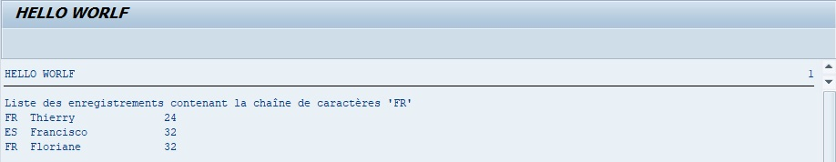

# FIND IN TABLE

```abap
FIND [{FIRST OCCURRENCE} | {ALL OCCURRENCES} OF] pattern IN TABLE itab [table_range]
     [IN {CHARACTER | BYTE} MODE]
     [{RESPECTING | IGNORING} CASE]
     [MATCH COUNT mcnt]
     { 
       {[MATCH LINE mlin] [MATCH OFFSET moff] [MATCH LENGTH mlen]} | [RESULTS result_tab|result_ls] 
     }.
```

L’instruction `FIND IN TABLE` possède les mêmes paramètres et se comporte exactement de la même façon que l’instruction [FIND](../../03_VARIABLES_&_CONSTANTES/02_VARIABLES_&_CONSTANTES/11_INSTRUCTION_FIND.md) dans une [VARIABLE](../../03_VARIABLES_&_CONSTANTES/02_VARIABLES_&_CONSTANTES/01_VARIABLES.md).

Exemple

Chercher toutes les occurrences `FR` dans la table `lt_citizen` et afficher les lignes concernées.

```abap
TYPES: BEGIN OF ty_citizen,
         country TYPE char3,
         name    TYPE char20,
         age     TYPE numc2,
       END OF ty_citizen.

DATA: lt_citizen TYPE STANDARD TABLE OF ty_citizen,
      lt_results TYPE TABLE OF match_result,
      ls_citizen TYPE ty_citizen,
      ls_results TYPE match_result.

FIELD-SYMBOLS: <lfs_citizen> TYPE ty_citizen.

ls_citizen-country = 'FR'.
ls_citizen-name    = 'Thierry'.
ls_citizen-age     = '24'.
APPEND ls_citizen TO lt_citizen.

ls_citizen-country = 'ES'.
ls_citizen-name    = 'Francisco'.
ls_citizen-age     = '32'.
APPEND ls_citizen TO lt_citizen.

ls_citizen-country = 'BR'.
ls_citizen-name    = 'Renata'.
ls_citizen-age     = '27'.
APPEND ls_citizen TO lt_citizen.

ls_citizen-country = 'FR'.
ls_citizen-name    = 'Floriane'.
ls_citizen-age     = '32'.
APPEND ls_citizen TO lt_citizen.

FIND ALL OCCURRENCES OF 'FR' IN TABLE lt_citizen
         IGNORING CASE
         RESULTS lt_results.

IF sy-subrc = 0.

  LOOP AT lt_results INTO ls_results.

    AT FIRST.
      WRITE: 'Liste des enregistrements contenant la chaîne de caractères ''FR'''.
    ENDAT.

    READ TABLE lt_citizen ASSIGNING <lfs_citizen> INDEX ls_results-line.
    IF sy-subrc = 0.
      WRITE: / <lfs_citizen>-country, <lfs_citizen>-name, <lfs_citizen>-age.
    ENDIF.

  ENDLOOP.

ENDIF.
```

Une nouvelle [TABLE INTERNE](../../07_TABLE_INTERNE/01_TABLES_INTERNES.md) va être créée `lt_results`, de référence `MATCH_RESULT`, même chose pour une [STRUCTURE](../../07_TABLE_INTERNE/08_STRUCTURES.md) standard utilisée pour stocker les résultats de l'instruction `FIND`. 

Après avoir rempli la [TABLE INTERNE](../../07_TABLE_INTERNE/01_TABLES_INTERNES.md) `lt_results`, le `FIND` sera exécuté avec la chaîne de caractère `FR` pour la [TABLE INTERNE](../../07_TABLE_INTERNE/01_TABLES_INTERNES.md) `lt_results`, sans prendre en compte la casse et stockant donc le résultat dans la table `lt_results`.

`lt_results`

| **LINE** | **OFFSET** | **LENGTH** | **...** |
| -------- | ---------- | ---------- | ------- |
| 1        | 0          | 2          | ...     |
| 2        | 3          | 2          | ...     |
| 3        | 0          | 2          | ...     |

Pour rappel, le premier champ liste les [INDEX](../../11_SQL/06_INDEX/01_Index.md) de lignes concernées par cette recherche, `OFFSET` la position où ma chaîne de caractère a été trouvée, `LENGTH` la longueur de la chaîne de caractères.

Le champ `LINE` sera ensuite utilisé dans le `LOOP` de la table `lt_results`, pour lire l'[INDEX](../../11_SQL/06_INDEX/01_Index.md) de la table `lt_results` et d'en afficher sa ligne.

Résultat


