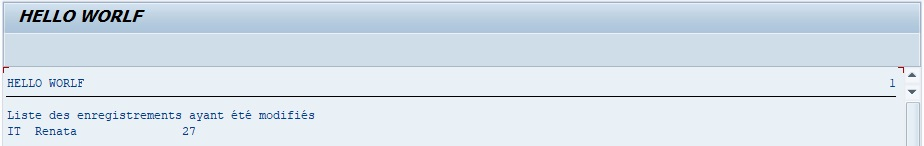

# REPLACE IN TABLE

```abap
REPLACE [{FIRST OCCURRENCE} | {ALL OCCURRENCES} OF] pattern IN TABLE itab WITH new
        [IN {CHARACTER|BYTE} MODE]
        [{RESPECTING|IGNORING} CASE]
        [REPLACEMENT COUNT rcnt]
        { 
          {
            [REPLACEMENT LINE rlin] [REPLACEMENT OFFSET roff] [REPLACEMENT LENGTH rlen]
          }
          | [RESULTS result_tab|result_wa] 
        }
```

L'instruction `REPLACE IN TABLE` possède les mêmes paramètre et se comporte exactement de la même façon que l'instruction [REPLACE](../../03_VARIABLES_&_CONSTANTES/02_VARIABLES_&_CONSTANTES/12_INSTRUCTION_REPLACE.md) dans une [VARIABLE](../../03_VARIABLES_&_CONSTANTES/02_VARIABLES_&_CONSTANTES/01_VARIABLES.md).

Exemple

Cercher toutes les occurrences `BR` dans la table `lt_citizen` et les remplacer par la chaîne de caractère `IT`.

```abap
TYPES: BEGIN OF ty_citizen,
         country TYPE char3,
         name    TYPE char20,
         age     TYPE numc2,
       END OF ty_citizen.

DATA: lt_citizen TYPE STANDARD TABLE OF ty_citizen,
      lt_results TYPE TABLE OF repl_result,
      ls_citizen TYPE ty_citizen,
      ls_results TYPE repl_result.

FIELD-SYMBOLS: <lfs_citizen> TYPE ty_citizen.

ls_citizen-country = 'FR'.
ls_citizen-name    = 'Thierry'.
ls_citizen-age     = '24'.
APPEND ls_citizen TO lt_citizen.

ls_citizen-country = 'ES'.
ls_citizen-name    = 'Francisco'.
ls_citizen-age     = '32'.
APPEND ls_citizen TO lt_citizen.

ls_citizen-country = 'BR'.
ls_citizen-name    = 'Renata'.
ls_citizen-age     = '27'.
APPEND ls_citizen TO lt_citizen.

ls_citizen-country = 'FR'.
ls_citizen-name    = 'Floriane'.
ls_citizen-age     = '32'.
APPEND ls_citizen TO lt_citizen.

REPLACE all OCCURRENCES OF 'BR' IN TABLE lt_citizen with 'IT'
            IGNORING CASE
            RESULTS lt_results.

IF sy-subrc = 0.

  LOOP AT lt_results INTO ls_results.

    AT FIRST.
      WRITE: 'Liste des enregistrements ayant été modifiés'.
    ENDAT.

    READ TABLE lt_citizen ASSIGNING <lfs_citizen> INDEX ls_results-line.
    IF sy-subrc = 0.
      WRITE: / <lfs_citizen>-country, <lfs_citizen>-name, <lfs_citizen>-age.
    ENDIF.

  ENDLOOP.

ENDIF.
```

La [TABLE INTERNE](../../07_TABLE_INTERNE/01_TABLES_INTERNES.md) `lt_results` va cette fois-ci prendre la référence de la [STRUCTURE](../../07_TABLE_INTERNE/08_STRUCTURES.md) `REPL_RESULT`.

``lt_results``

| **LINE** | **OFFSET** | **LENGTH** |
| -------- | ---------- | ---------- |
| 3        | 0          | 2          |

Pour rappel, le premier champ liste les [INDEX](../../11_SQL/06_INDEX/01_Index.md) de lignes concernées par la modification, `OFFSET` la position où la chaîne de caractères a été remplacée, `LENGTH`, la longueur de la chaîne de caractères.

Le champ `LINE` sera ensuite utilisé dans le [LOOP](../09_Loop/01_Loop_at_itab.md) de la table `lt_results`, pour lire l’[INDEX](../../11_SQL/06_INDEX/01_Index.md) de la table `lt_results` et d’en afficher sa ligne.

Résultat


