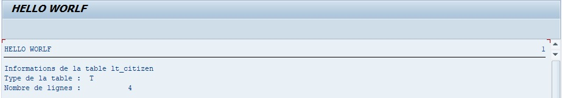

# DESCRIBE TABLE

```abap
DESCRIBE TABLE itab [KIND knd] [LINES lin].
```

Cette instruction permet de décrire une [TABLE INTERNE](../../07_TABLE_INTERNE/01_TABLES_INTERNES.md) en retournant les informations suivantes :

- Le type de [TABLE INTERNE](../../07_TABLE_INTERNE/01_TABLES_INTERNES.md) (`KIND knd`) ayant pour valeur

  - `T` : [STANDARD](../../07_TABLE_INTERNE/02_TYPE_STANDARD.md)

  - `S` : [SORTED](../../07_TABLE_INTERNE/03_TYPE_SORTED.md)

  - `H` : [HASHED](../../07_TABLE_INTERNE/04_TYPE_HASHED.md)

  - `void` (vide/rien/nada) : indéfini

    Ces valeurs se retrouvent également dans la [STRUCTURE STANDARD](../../07_TABLE_INTERNE/01_TABLES_INTERNES.md) `SYDES_KIND`.

- Le nombre de lignes contenues dans la [TABLE INTERNE](../../07_TABLE_INTERNE/01_TABLES_INTERNES.md) (`LINES lin`).

Exemple

Retourner toutes les informations de la table `lt_citizen`.

```abap
TYPES: BEGIN OF ty_citizen,
         country TYPE char3,
         name    TYPE char20,
         age     TYPE numc2,
       END OF ty_citizen.

DATA: lt_citizen TYPE STANDARD TABLE OF ty_citizen,
      ls_citizen TYPE ty_citizen.

ls_citizen-country = 'FR'.
ls_citizen-name    = 'Thierry'.
ls_citizen-age     = '24'.
APPEND ls_citizen TO lt_citizen.

ls_citizen-country = 'ES'.
ls_citizen-name    = 'Francisco'.
ls_citizen-age     = '32'.
APPEND ls_citizen TO lt_citizen.

ls_citizen-country = 'BR'.
ls_citizen-name    = 'Renata'.
ls_citizen-age     = '27'.
APPEND ls_citizen TO lt_citizen.

ls_citizen-country = 'FR'.
ls_citizen-name    = 'Floriane'.
ls_citizen-age     = '32'.
APPEND ls_citizen TO lt_citizen.

DESCRIBE TABLE lt_citizen KIND DATA(lv_kind) LINES DATA(lv_lines).

WRITE : /'Informations de la table lt_citizen'.
WRITE : /'Type de la table : ', lv_kind.
WRITE : /'Nombre de lignes : ', lv_lines.
```

Résultat


