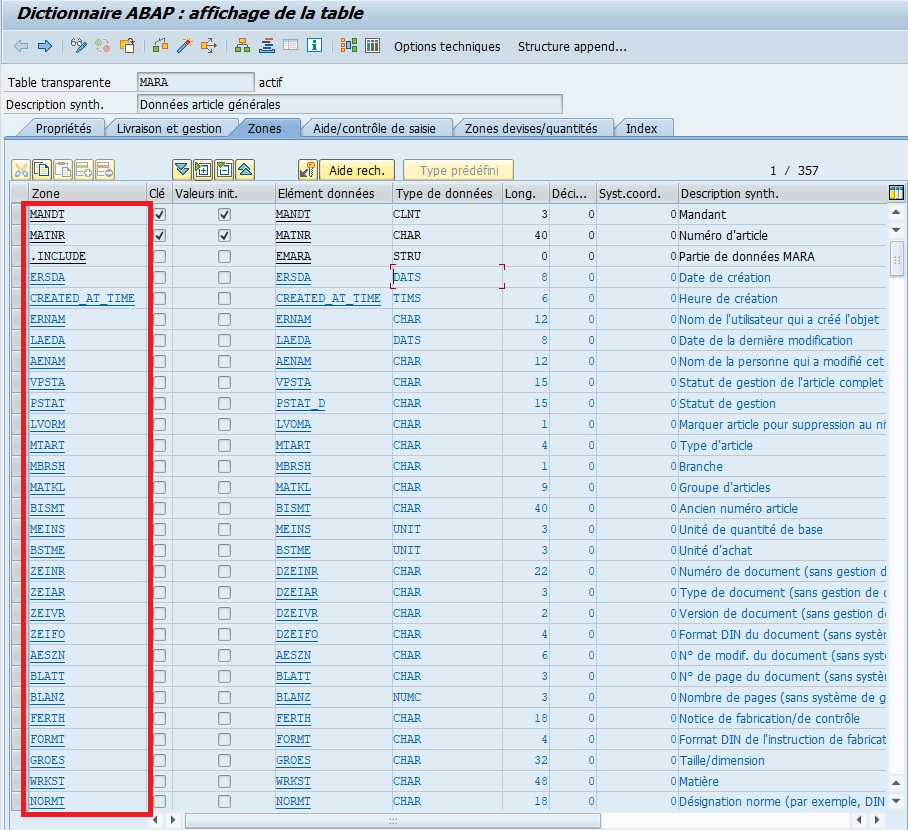
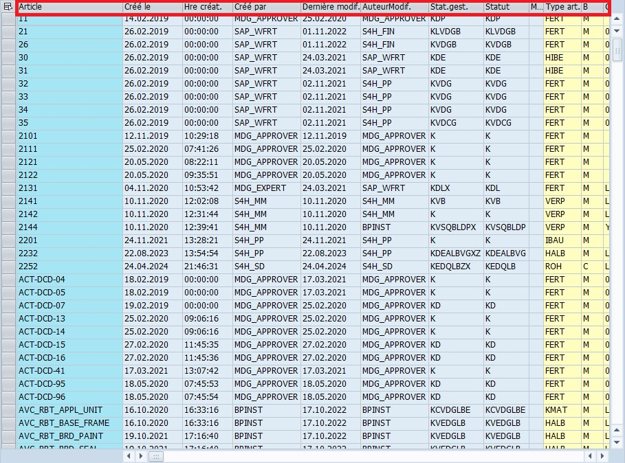

# CHAMPS

Sur SAP, un `champ` (ou zone) dans une [TABLE](../08_DB_TABLES/02_TABLES.md) ou une [STRUCTURE DE TABLE](./06_STRUCTURES.md) fait référence à une colonne spécifique qui contient des données particulières.
>
Ces `champs` sont utilisés pour organiser et stocker des informations dans la base de données de SAP. Par exemple, dans une table de clients, un `champ` pourrait être `Nom` ou `Adresse`. Chaque `champ` a un type de données spécifique, comme texte, nombre ou date, qui définit le type d'information qu'il peut contenir (voir [DOMAINES](./04_DOMAINES.md)).

## CHAMPS EN SE11 (STRUCTURE)

Structure MARA

## CHAMPS EN SE16N (TABLE DE DONNEES)

Table MARA

