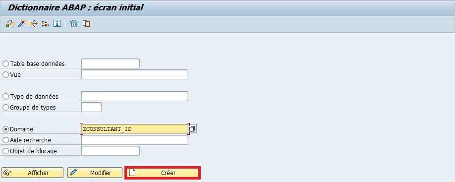
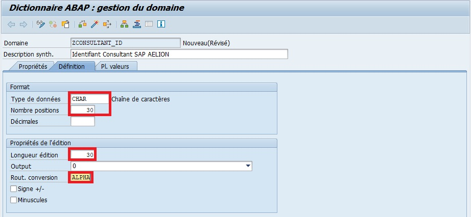

# DOMAINES

[Transaction SE11](./02_SE11.md)

C’est le niveau le plus "bas" de la description d’une données. Il va définir les caractéristiques techniques de base d’un [CHAMPS](./03_CHAMPS.md) contenu dans une [TABLE](../08_DB_TABLES/02_TABLES.md).

Exemple de caractéristiques techniques :

- `CHAR` : chaîne de caractères alphanumériques (et donc contenant aussi bien des chiffres que des lettres) toujours considérée comme un texte.​

- `CURR` : pour l’anglais Currency, devise d’un montant (euro, dollar…)​

- `DATS` : format date​

- `DEC` : décimal pouvant contenir bien sûr une décimale mais aussi un signe(+ ou -), et un séparateur de milliers (31 positions max)​

- ``FLTP`` : nombre flottant incluant aussi une décimale, mais dont la longueur maximale ne peut être supérieure à 16 positions.

- `INT1`, `INT2` et `INT4`: utilisés pour les nombres entiers​

- `NUMC` : texte numérique, ou plus précisément un nombre qui sera considéré à la fois comme une valeur numérique et un texte (utiles lors d’une concaténation d’un texte et d’un chiffre incrémenté dans une boucle)​

- `STRING` : chaîne de caractères ayant une longueur importante (utilisé pour une description par exemple)​

- `XSTRING` : N’importe quelle chaîne hexadécimale

    Note : Il en existe d'entres mais ces derniers sont peu utilisés.

## SE11

    Note : afin de faciliter la compréhension, nous allons prendre l'exemple du domaine MATNR, accessible depuis la Transaction SE11 en entrant dans l'input "Domaine" le nom du domaine rechercher. Cliquer ensuite sur [ Afficher ] (or "Display")

### MENU

- ``Deux flèches`` : (Objet précédent et Objet suivant) pour naviguer entre les écrans.

- ``Afficher <-Modifier`` :  pour passer à la modification en cas d’affichage et inversement [Ctrl][F1]

- ``Actif <-Inactif`` permet de naviguer entre la version active et la version inactive (utile pour voir les modifications en cours avant activation finale) .

  Domaine - Actif <-Inactif

- ``Autre Objet`` : 

  pour sélectionner un autre domaine sans repasser par l’écran initial de la SE11. [Shift][F5]

- ``Contrôler`` [ Ctrl ] + [ F2 ]

- ``Activation ``[ Ctrl ] + [ F3 ]

- ``Cas d’Emploi`` [ Ctrl ] + [ Shift ] + [ F3 ]

- ``Afficher Liste d’objets`` : 

    Affichage de tous les objets ayant une même caractéristique, comme par exemple, tous les objets utilisant la même classe de développement (cf. chapitre Premiers pas sur SAP - Premier programme ABAP - ’Hello World’) [ Ctrl ] + [ Shift ] + [ F5 ]

- ``Afficher fenêtre de navigation`` ouvre un volet situé en bas de l’écran avec tous les objets modifiés facilitant le passage de l’un à l’autre [ Ctrl ] + [ Shift ] + [ F4 ]

- ``Activer/Désactiver plein écran`` va afficher ou masquer les deux options citées précédemment, si elles ont déjà été activées .

- ``Manuel en ligne`` est l’aide SAP disponible [ Ctrl ] + [ F8 ]

### DESCRIPTION

### ONGLET PROPRIETES

- `Derniere modification` du domaine

- `Package` du domaine

- `Langue d'origine` du domaine (lors de sa création)

### ONGLET DEFINITION

- `Type de données` caractérisant le format du domaine

- `Nombre positions` Il s'agit du nombre de caractères d'un type de données du Dictionnaire ABAP qui se rapporte à un type de données élémentaire sans caractères de mise en forme (par ex. virgules ou points).

- `Décimales`

- `Longueur édition` Il s'agit de la longueur d'édition comme partie des proprietés d'édition de domaines.

- `Rout. Conversion` Il s'agit de la routine de conversion comme partie des proprietés d'édition de domaines.

- `Signe +/-` paramètre du domaine

- `Minuscules` paramètre du domaine

### ONGLET PLAGE DE VALEURS

Une plage de valeur pour un domaine fait référence à une gamme ou à un ensemble de valeurs autorisées pour ce champ.

Si elle est renseignée lors de la création du `domaine`, lorsqu’un utilisateur emploiera une [VARIABLE](../03_VARIABLES_&_CONSTANTES/02_VARIABLES_&_CONSTANTES/01_VARIABLES.mdd) définie par ce `domaine`, SAP ira vérifier si la valeur renseignée existe bien en consultant cette `plage de valeur`. Si elle n’existe pas il renverra un message d’erreur.

## ROUTINE DE CONVERSION

Les `domaines` donne la possibilité de définir une `routine de conversion` qui, par exemple, convertira/complétera la valeur d’autant de 0 que nécessaire afin d’arriver au nombre de position par exemple (très utile pour homogénéiser les données, les gérer).

## CREATION D'UN DOMAINE

1. [Transaction SE11](./02_SE11.md).

      

2. `Cocher` l’option `Domaine`.

      

3. `Nommer` le domaine (exemple `ZCONSULTANT_ID`).

      

4. `Créer` ou [ F5 ].

      

5. `Entrer` une `description` (obligatoire) (exemple `Identifiant Consultant SAP AELION`).

      

6. Insérer les informations suivantes :

   - `Type de données` : CHAR.

   - `Nombre positions` : 30.

   - `Longueur édition` : 30.

   - `Rout. conversion` : ALPHA.

      

7. `Sauvegarder`.

      

      

8. `Contrôler`.

      

      

9. `Activer`

      

      

      

    Note : les étapes `6`, `7` et `8` sont facultatives. SAP controllera l’objet de manière automatique pour vérifier que le domaine est viable et ne posera pas de problème.

    Note : Lors de l'activation, veiller à n'activer que les objets dont vous êtes responsables ! Il se peut que, comme dans l'exemple, d'autre(s) élément(s) soi(en)t en attente d'activation.