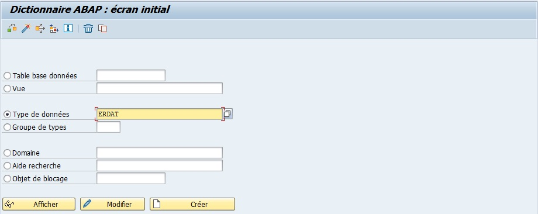

# ELEMENTS DE DONNEES

[Transaction SE11](./02_SE11.md)

## EXEMPLE DE ERDAT (DATE DE CREATION DE L'ENREGISTREMENT)

Un `élément de données` est la zone de référence d’une donnée. ​

Un `élément de données` est associé à un et un seul [DOMAINE](./04_DOMAINES.md), mais plusieurs `éléments de données` utilisent le même `domaine`. Le libellé descriptif de la `donnée` est celui de son `élément de donnée`.​

Un `élément de données` est associé à un et un seul `Type de données`, mais plusieurs `éléments de données` utilisent le même `Type de données`.

## CREATION DE L'ELEMENT DE DONNEES

### PRE-REQUIS

Un [DOMAINE](./04_DOMAINES.md) déjà identifié (ici, nous utiliseront le [DOMAINE](./04_DOMAINES.md) créé précédemment à savoir ZCONSULTANT_ID).

### CREATION

1. [Transaction SE11](./02_SE11.md).

      

2. `Cocher` l’option `Type de données`.

      

3. `Nommer` l'élément (exemple `ZCONSULTANT_ID`).

      

4. `Créer` ou [ F5 ].

      

5. `Sélectionner` `Elément de données`.

      

6. `Entrer` une `description` (obligatoire) (exemple `N° d’identification du consultant`).

      

7. `Renseigner` le [DOMAINE](./04_DOMAINES.md) (exemple `ZCONSULTANT_ID`).

      

8. `Appuyer` sur [ Entrée ].

      

9. `Renseigner` les descriptions de zone dans l'onglet `Descript. zone`

   | LONGUEUR   | NBR CARACTERES | NOM                          |
   | ---------- | -------------- | ---------------------------- |
   | `Court`    | 10             | Consultant                   |
   | `Moyen`    | 20             | Ident.Consult.               |
   | `Long`     | 40             | Identification Consultant    |
   | `Intitulé` | 55             | Identification du Consultant |

      

10. `Sauvegarder`

      

      

      

11. `Contrôler`.

      

      

12. `Activer`.

      

      

      
