# STRUCTURES DE TABLE

[Transaction SE11](./02_SE11.md)

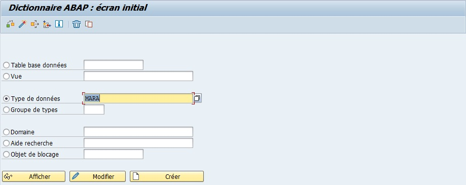

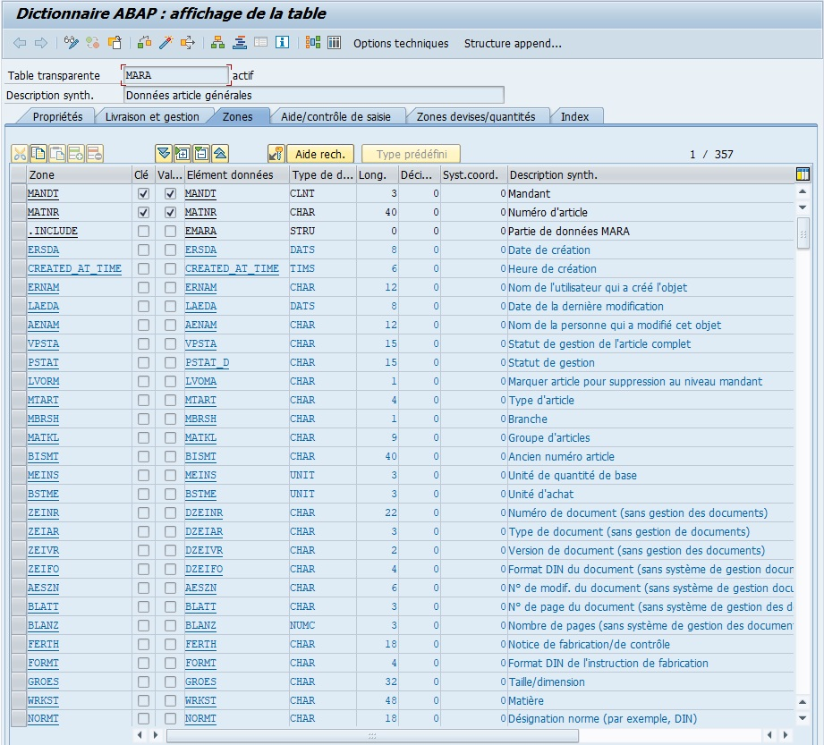

Une `structure` est un ensemble de zones définies par rapport à des [ELEMENTS DE DONNEES](./05_ELEMENTS_DE_DONNEES.md), mais `sans stockage physique` dans la `base de données`. Les `structures` constituent la plupart du temps des descriptions utilisées comme zones de passage d’information.​ Elles sont des modèles (comme des patrons en couture) à partir desquelles il sera possible d'effectuer des actions.

    Autrement dit, c'est un modèle, un squelette, un plan, ... à partir duquel il sera possible de créer une table et une ... structure ! Nous verrons ce point plus tard dans le cours.

## APPEND & INCLUDE

Deux notions très importantes du `DDIC` sont : l’`Include` (pouvant être traduit par `inclusion` en français) et l’`Append` (`ajout`) de `structure`. Ces deux notions ont le même but, qui est de rajouter des [CHAMPS](./03_CHAMPS.md) supplémentaires.

L’`Include` et l’`Append` sont aussi bien utilisés pour une [TABLE](../08_DB_TABLES/02_TABLES.md) que pour une structure. Ce qui sera traité maintenant vaut donc également pour les [TABLE](../08_DB_TABLES/02_TABLES.md) du DDIC.

    L’include et l’append sur des structures ou tables standards sont des cas très sensibles du DDIC qui doivent être manipulés avec beaucoup de précaution.

### INCLUDE DE STRUCTURE

Additionne les [CHAMPS](./03_CHAMPS.md) venus d’une `structure` existante. Par exemple, la [TABLE](../08_DB_TABLES/02_TABLES.md) `MARA`, utilise l’`Include EMARA` pour insérer tous les [CHAMPS](./03_CHAMPS.md) existants de cette `structure`. Ainsi si cette dernière est mise à jour (suppression, ajout ou modification de [CHAMPS](./03_CHAMPS.md)), la [TABLE](../08_DB_TABLES/02_TABLES.md) `MARA` sera impactée et subira automatiquement cette même actualisation.

Lors de l’utilisation d’un `Include` ou d’un `Append`, les [CHAMPS](./03_CHAMPS.md) listés sont de couleur bleue, signifiant qu’ils ne sont pas directement liés à la [TABLE](../08_DB_TABLES/02_TABLES.md) mais qu’ils font partie d’un ensemble extérieur.

Même si cette modification reste propre à la [TABLE](../08_DB_TABLES/02_TABLES.md) ou `structure`, il est possible d’imaginer, pour reprendre l’exemple de la [TABLE](../08_DB_TABLES/02_TABLES.md) `MARA` et de son `Include EMARA`, le degré d’impact qu’aurait l’ajout d’un `Append` de `structure` à cette dernière. Il resterait local mais aurait automatiquement des répercussions sur la [TABLE](../08_DB_TABLES/02_TABLES.md) `MARA`.

EXEMPLE :

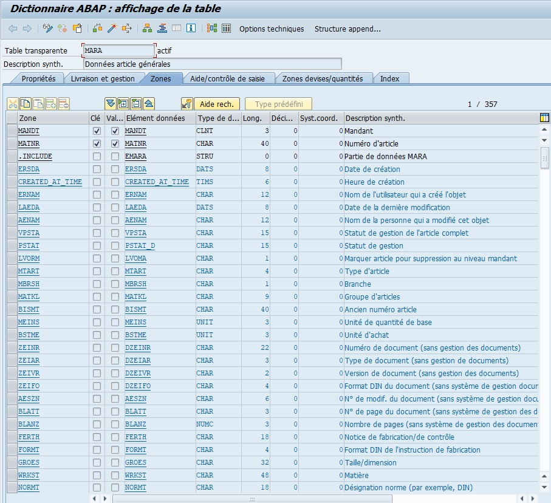

### APPEND DE STRUCTURE

Ajoute des [CHAMPS](./03_CHAMPS.md) supplémentaires mais reste cependant propre à la [TABLE](../08_DB_TABLES/02_TABLES.md) ou `structure`. En effet, si pour un traitement spécifique, il est nécessaire de stocker une information dans une [TABLE](../08_DB_TABLES/02_TABLES.md) `standard`, l’idée serait alors de créer un nouveau [CHAMP](./03_CHAMPS.md) sauf que comme il s’agit d’une [TABLE](../08_DB_TABLES/02_TABLES.md) `standard`, SAP bloque sa modification (pour des raisons de sécurité et de stabilité de la solution). Il est cependant possible de le rajouter via une `structure APPEND`. Ainsi, la `structure` initiale n’est pas touchée par cette modification qui reste localisée dans une `structure` bis annexée.

Par exemple, la [TABLE](../08_DB_TABLES/02_TABLES.md) standard `KNA1` regroupant les données des clients, utilise un `APPEND` de `structure` de `type Z`. Comme indiqué précédemment, il était nécessaire d’ajouter un [CHAMP](./03_CHAMPS.md) supplémentaire pour un développement spécifique dans cette [TABLE](../08_DB_TABLES/02_TABLES.md). Ici, il s’agit d’un numéro spécifique à l’entreprise non pris en compte par SAP et nécessaire pour la fiche client.

EXEMPLE :

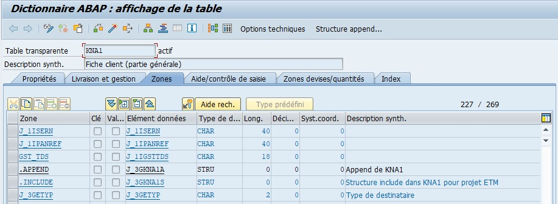

## CREATION D'UNE STRUCTURE DE TABLE

1. [Transaction SE11](./02_SE11.md).

      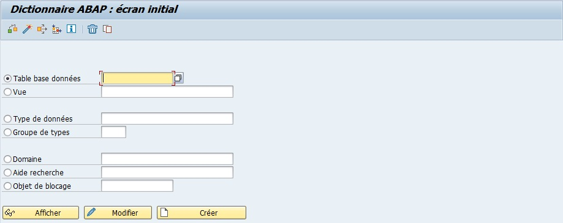

2. `Cocher` l’option `Type de données`.

      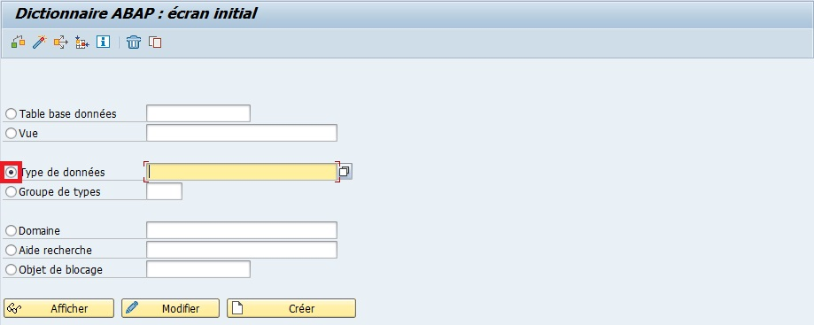

3. `Nommer` l'élément (exemple `ZST_CONSULTANT`).

      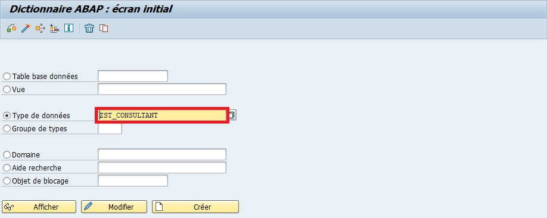

4. `Créer` ou [ F5 ].

      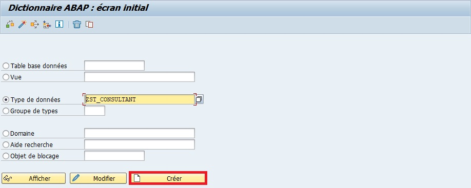

5. `Sélectionner` `Structure`.

      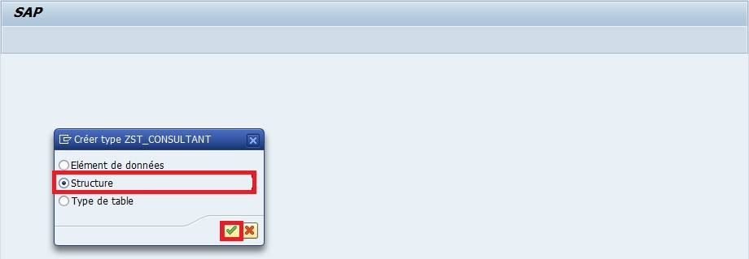

6. `Entrer` une `description` (obligatoire) (exemple `Structure de Table ZT_CONSULTANT`).

      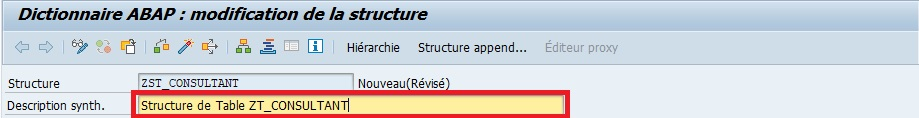

7. `Insérer` les signes suivantes

   | COMPOSANTE      | CATEGORIE TYPE | TYPE COMPOSANTE |
   | --------------- | -------------- | --------------- |
   | `CONSULTANT_ID` | TYPES          | ZCONSULTANT_ID  |
   | `VILLE`         | TYPES          | CITY            |
   | `PAYS`          | TYPES          | LAND_X          |

      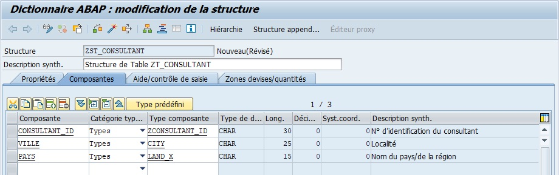

8. `Sauvegarder`

      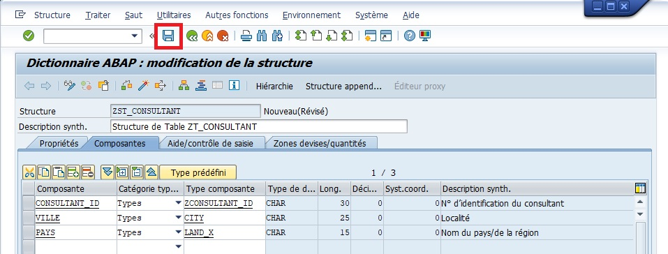

      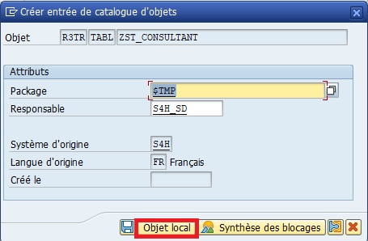

      

9. `Contrôler`.

      

      

12. `Activer`.

      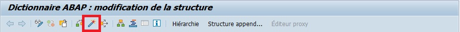

      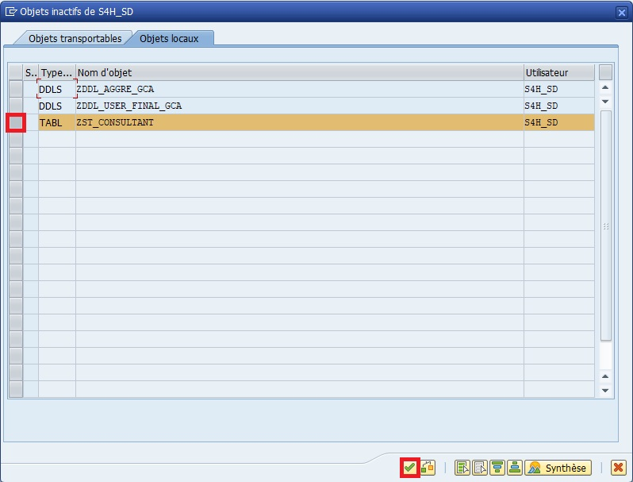

      
