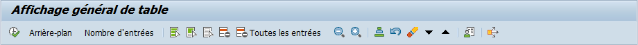

# TRANSACTION SE16N

La ``transaction SE16N`` sur SAP est une fonctionnalité très utile qui permet d'accéder et de visualiser les données stockées dans les tables de la base de données SAP sans avoir besoin de compétences techniques avancées en programmation. La SE16N sert notamment pour :

- ``Visualisation des données`` : 

  La SE16N permet aux utilisateurs de visualiser facilement les données contenues dans les [tables](./08_TABLES.md) SAP. Cela peut être utile pour examiner les informations sur les clients, les fournisseurs, les produits, les transactions financières, etc.

- ``Analyse rapide`` : 

  Les utilisateurs peuvent rapidement filtrer et trier les données pour obtenir des informations spécifiques. Cela permet une analyse rapide et efficace des données sans avoir besoin de créer des rapports complexes.

- ``Dépannage`` : 

  Lorsqu'un problème survient dans le système SAP, la SE16N peut être utilisé pour examiner les données pertinentes et identifier les éventuelles erreurs ou incohérences.

- ``Tests et développement`` : 

  Les développeurs et les testeurs peuvent utiliser la SE16N pour vérifier les données pendant le processus de développement ou de test de nouvelles fonctionnalités ou de modifications dans SAP.

- ``Exportation de données`` : 

  Les données visualisées dans la SE16N peuvent être exportées vers des formats tels que Excel pour un traitement ultérieur ou pour créer des rapports personnalisés.

## FENETRE DE SELECTION

### MENU

- `En ligne` (Exécuter) [ F8 ]

- `Traitement en arrière plan` [ Ctrl ] + [ F8 ]

- `Nombre d'entrées` permet de savoir où est utilisé l’objet [ F7 ]

- `Sélectionner tout` les champs de la table [ Maj ] + [ F1 ]

- `Sélectionner zones clés pour édition` sélectionne les clés de la table [ Ctrl ] + [ F6 ]

- `Démarquer tout` déselectionne tous les champs de la table [ Maj ] + [ F6 ]

- `Supprimer ligne` supprime la valeur entrée dans la ligne de recherche de valeur [ Maj ] + [ F2 ]

- `Supprimer toutes les entrées` supprime les valeurs entrées dans toutes les ligne de recherche de valeur [ Ctrl ] + [ F1 ]

- `Largeur de colonne étroite` à l'affichage de la table [ Ctrl ] + [ F4 ]

- `Largeur de colonne normale` à l'affichage de la table [ Ctrl ] + [ F5 ]

- `Trier par zones utilisées` [ Ctrl ] + [ Maj ] + [ F1 ]

- `Annuler tri de zones de sélection` [ Ctrl ] + [ Maj ] + [ F2 ]

- `Supprimer tri de zones de sélection` [ Ctrl ] + [ Maj ] + [ F7 ]

- `Activation du curseur sur le critère de sélection suivant` [ Ctrl ] + [ Maj ] + [ F4 ]

- `Activation du curseur sur le critère de sélection précédent` [ Ctrl ] + [ Maj ] + [ F3 ]

- `Modifier les options` d'affichage [ Ctrl ] + [ F12 ]

- `Cas d'emploi` [ Ctrl ] + [ F2 ]

### FILTRES

- ``Table`` ciblée pour l'affichage des données

- `Table texte` indique le nom de la table possédant les valeurs des textes de la table ciblée

- `Mise en forme` particulière à l'affichage

- `Nombre d'occurrences max` à l'affichage des données de la table ciblée

- `Accéder à zone` recherche une zone en particulier et la déplace vers les premières colonnes à l'affichage

### CRITERES DE SELECTION

- ``Options de comparaison`` : 

- `Recherche d'une valeur en particulier` :

- `Recherche de données comprises dans une plage` : 

- `Sélection multiple de valeur et/ou de plage`

- `Affichage ou non du champ`

## FENETRE D'AFFICHAGE (A L'EXECUTION)

### MENU

- `Rafraîchir` [ F8 ]

- `Afficher critères de sélection` (SQL) [ Maj ] + [ F1 ]

  

- `Afficher critères de sélection : vue de gestion` (SQL) [ Maj ] + [ F2 ]

- `Afficher sélection comme ABAP` (ABAP) [ F9 ]

  

### FONCTIONNALITE DE LA TABLE

- `Détails`

  

- `Tri par ordre croissant`

- `Tri décroissant`

- `Rechercher`

- `Rechercher l'occurrence suivante`

- `Définir filtre...`

- `Total`

- `...`

- `Imprim.`

- `Affichage`

- `Exporter`

- `Sélectionner mise en forme`

- `Document utilisateur` (lien vers SAP Help)

- `Vue détaillée`

  

- `Afficher/Masquer les colonnes vides`

### TABLES DE DONNEES

- [CHAMPS](../07_DDIC/03_CHAMPS.md)

  

- `Valeurs`

  

- [Clé(s)](./02_TABLES.md)

  
