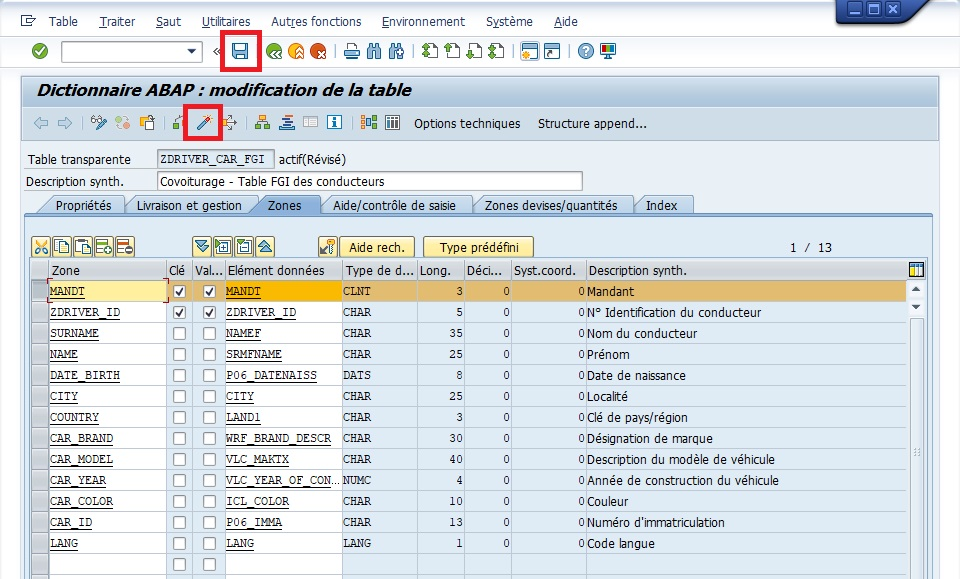

# TABLES

[Transaction SE11](./02_TRANSATION_SE11.md)

- Une `Table` est un ensemble de `zones` ([champs](./04_CHAMPS.md)) définies par rapport à des [éléments de données](./06_ELEMENTS_DE_DONNEES.md). ​

- Une `Zone` ([champs](./04_CHAMPS.md)) est toujours définie par rapport à une `table` . ​

- La `clé primaire` d’un `table` est formée de la concaténation de l’ensemble des [champs](./04_CHAMPS.md) clé de la `table`.​ Cette `clé primaire` détermine un enregistrement unique pour la `table` .​

- Une `table` est dite `mandant dépendante` si la zone `MANDANT` fait partie de la `clé primaire`.​

## CLES PRIMAIRES

Les `clés primaires`, souvent abrégées en "PK" pour "Primary Key" en anglais, sont un concept fondamental en gestion de base de données. Une `clé primaire` est un ou plusieurs [CHAMPS](../07_DDIC/03_CHAMPS.md) dans une `table de base de données` qui identifient de manière unique chaque enregistrement dans cette table. Voici quelques points importants à retenir sur les `clés primaires` :

- `Unicité des enregistrements` : La `clé primaire` garantit que chaque enregistrement dans la `table de base de données` est unique. Cela signifie qu'aucun deux enregistrements ne peut avoir la même valeur de `clé primaire`.

- `Contrainte d'intégrité` : Les `clés primaires` sont souvent définies comme une `contrainte d'intégrité` dans la `base de données`, ce qui signifie que le système de gestion de `base de données` (`SGBD`) garantit que la `clé primaire` est respectée à tout moment. Ainsi, les tentatives d'insertion ou de mise à jour d'enregistrements qui violeraient cette `contrainte` sont automatiquement rejetées.

- `Indexation automatique` : Les `clés primaires` sont souvent indexées automatiquement par le `SGBD` pour améliorer les performances des opérations de recherche et de `jointure` sur la table. Cela permet d'accélérer l'accès aux données lors de l'exécution de requêtes.

- `Définition lors de la conception de la base de données` : Les `clés primaires` sont définies lors de la conception initiale de la `base de données`. Les concepteurs de `bases de données` choisissent les [CHAMPS](../07_DDIC/03_CHAMPS.md) qui doivent former la `clé primaire` en fonction des exigences spécifiques de l'application et des relations entre les données.

- `Types de clés primaires` : Une `clé primaire` peut être composée d'un seul [CHAMPS](../07_DDIC/03_CHAMPS.md) (`clé primaire simple`) ou de plusieurs [CHAMPS](../07_DDIC/03_CHAMPS.md) combinés (`clé primaire composite`). Dans le cas d'une `clé primaire composite`, l'ensemble des valeurs de tous les [CHAMPS](../07_DDIC/03_CHAMPS.md) formant la clé doit être unique.

## CATEGORIES DE TABLE

### TABLES STANDARDS

Dans le contexte de SAP, une `table standard` fait référence à une table pré-définie qui est fournie par SAP dans son ensemble de modules et de solutions logicielles. Ces tables standard contiennent des données qui sont essentielles pour le fonctionnement du système SAP ou pour des processus métier spécifiques.

EXEMPLE :

- `MARA` : Table standard utilisée pour stocker les données de base des articles (matériaux).
- `KNA1` : Table standard utilisée pour stocker les données de base des clients.
- `BKPF` : Table standard utilisée pour stocker les en-têtes de documents comptables.
- `VBAP` : Table standard utilisée pour stocker les positions de documents de vente.
- `MSEG` : Table standard utilisée pour stocker les mouvements de stock.

### TABLES SPECIFIQUES

Une `table spécifique` dans SAP fait référence à une table qui est créée spécifiquement pour répondre aux besoins particuliers d'une entreprise ou d'un projet. Contrairement aux tables standard fournies par SAP, qui sont préconfigurées et couvrent généralement les processus métier courants, une `table spécifique` est conçue et mise en place pour stocker des données spécifiques à un contexte particulier.

EXEMPLE :

- `ZCUSTOMER` : Table spécifique créée pour stocker des informations supplémentaires sur les clients.
- `ZSALESORDER` : Table spécifique créée pour stocker des informations personnalisées sur les commandes de vente.
- `ZVENDOR_MASTER` : Table spécifique créée pour stocker des données supplémentaires sur les fournisseurs.
- `ZEMPLOYEE_TIME` : Table spécifique créée pour stocker les données de suivi du temps des employés.
- `ZPROJECT_TASKS` : Table spécifique créée pour suivre les tâches et les étapes d'un projet spécifique.
- `Table TVARV et TVARVC`

## TYPES DE TABLE

### TABLE DE PARAMETRES (P)

Une `table de paramètres` dans SAP est une structure de données utilisée pour stocker des valeurs de paramètres système ou des configurations spécifiques à l'utilisateur. Ces tables sont principalement utilisées pour stocker des valeurs temporaires ou des valeurs de configuration qui sont utilisées par les programmes SAP pendant l'exécution.

EXEMPLE :

Des exemples de `tables de paramètres` dans SAP incluent les tables `S_PARAM`, qui stockent les paramètres système globaux, et les tables `SUSR\*`, qui stockent les paramètres utilisateur.

### TABLE TRANSPARENTE

Une `table transparente` dans SAP est une structure de données qui stocke des informations de manière tabulaire, similaire à une `table de base de données classique`.

### TABLE DE POOL (S)

Une `table de pool` dans SAP est une structure de données utilisée pour stocker des enregistrements ayant une structure similaire et partageant un espace de stockage commun avec d'autres `tables de pool`.

### TABLES CLUSTER (CLUSTER)

Une `table cluster` dans SAP est une structure de données qui regroupe plusieurs tables logiques ayant des [CHAMPS](../07_DDIC/03_CHAMPS.md) communs dans une seule table physique dans la `base de données`. L'objectif principal d'une `table cluster` est d'améliorer les performances d'accès aux données en réduisant le nombre de `jointures` nécessaires pour récupérer des informations. des opérations de lecture, d'écriture et de mise à jour selon les besoins de l'application.

### TABLES DE TEXTE (T)

Une `table de texte` dans SAP est une structure de données utilisée pour stocker des descriptions ou des textes associés à des enregistrements dans d'autres tables. Ces tables sont utilisées pour stocker des descriptions multilingues ou des textes explicatifs qui sont liés à des enregistrements dans d'autres tables de données.

EXEMPLE :

Des exemples de `tables de texte` dans SAP incluent les tables `T001` pour les textes de société, les tables `T002` pour les textes de langues, les tables `KNA1` pour les textes de clients, etc.

### TABLE DE POOL DE GENERATION DE NUMEROS (NUMC)

Les `tables de pool de génération de numéros` dans SAP sont des structures de données utilisées pour générer des numéros uniques et séquentiels pour différents objets ou processus dans le système SAP.

### TABLE DE DONNEES TEMPORAIRES (TEMP)

Une `table de données temporaires` dans SAP est une structure de données utilisée pour stocker temporairement des informations pendant l'exécution d'une session SAP. Contrairement aux tables persistantes qui conservent les données de manière permanente, les `tables de données temporaires` ne conservent les données que pour la durée de vie de la session ou de la `transaction` en cours.

## CREATION D'UNE TABLE EN SE11

1. [Transaction SE11](../07_DDIC/02_SE11.md).

      

2. `Sélectionner` l’option `Table base données`

      

3. `Entrer` le nom de la table (exemple ZDRIVER_CAR_FGI).

      

4. `Créer` ou [ F5 ]

      

5. `Entrer` une `description` (obligatoire) (exemple `Table des Consultants SAP`).

      

6. Onglet `Livraison et gestion` :

   - `Class de livraison` : `classe A`

      

   - `Gestion Dara Browser/vue table` : `Affichage/gestion autorisés`

      

7. `Onglet Zones`

      

8. `Renseigner` les champs avec leurs [ZONES](../07_DDIC/03_CHAMPS.md), `Clé(s)` et [ELEMENTS DE DONNEES](../07_DDIC/05_ELEMENTS_DE_DONNEES.md)

      

9. `Clé externe`

      

      

      

      

    Note : répéter les mêmes étapes pour le champ COUNTRY.

    Note : Aucune information à renseigner dans l’onglet Zones devises/quantités étant donné qu’il n’y a aucune unité de mesure nécessaire.

10. `Sauvegarder` et `Activer`

      

      

11. `Catégorie d'extension`

      La catégorie d’extension n’est pas obligatoire mais recommandée car elle définit le type de champs qui composeront la table (extension de la table doit être compris par ajout de champs dans la table directement ou grâce à un append dans le cas de tables standards).

      

      

    Note : Pour information

    - Extensible sans restriction : pas de règle pour l’extension de la table ou de la structure.

    - Extensible et alphanumérique ou numérique : tous les champs devront être soit alphanumériques, soit numériques. La différence avec Extensible sans restriction est qu’il ne sera pas possible d’ajouter des champs de type date ou heure (par exemple) dans un append ou un include.

    - Extensible et alphanumérique : la table ou la structure ne sera composée que de champs alphanumériques et une erreur sera retournée si un champ est défini comme numérique (il sera alors possible de modifier le type d’extension).

    - Non extensible : il sera possible d’ajouter un champ directement à la table ou la structure initiale, mais impossible via un append. Ainsi, comme l’append est l’unique moyen d’ajouter un champ à une table standard, il n’y aura aucune possibilité pour accomplir cette tâche.

    - Non classifié (par défaut), aucune extension n’a été définie pour la table ou la structure.

    Dans le cas de notre table, il n’y aura pas besoin de restriction, l’option Extensible sans restriction sera donc choisie.

12. Onglet `Aide/contrôle de saisie`

      Ici, il n'y a rien à ajouter car nous n'avons pas de quantité et donc pas d'unité de mesure. Lorsque vous aurez à crééer une table avec un champ ayant une quantité telle qu'un nombre de pièce, une taille, le montant d'une devise, ... il faudra (juste en dessous de la ligne en question) ajouter une ligne avec le champ correspondant à son unité de mesure. Par exemple :

      - Quantité de pièce : 13
      - Type de pièce : palette

      ou encore

      - Montant : 12807
      - Devise : Euros

      En général, ces informations vous seront transmises dans la spécification fonctionnelle.

13. `Sauvegarder` puis cliquer sur `Options techniques`

14. Onglet `Propriétés générales`, renseigner les éléments suivant comme suit :

      - `Type de données` : APLL0
      - `Catég. taille` : 0

10. `Sauvegarder` puis [ Flèche verte ] pour revenir à l'écran précédent.

11. `Activer`
