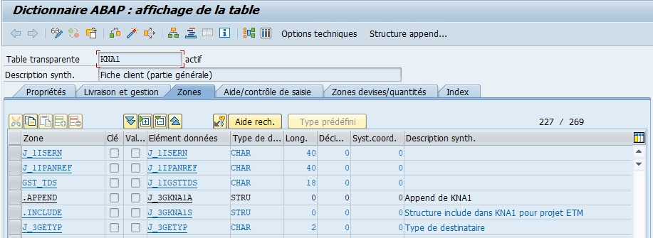

# APPEND

Deux notions très importantes du [DDIC](../07_DDIC/01_DICTIONNAIRE_DE_DONNEES.md) sont : l’[INCLUDE](./03_INCLUDE.md) (pouvant être traduit par `inclusion` en français) et l’`APPEND` (`ajout`) de [STRUCTURE](../07_DDIC/06_STRUCTURES.md). Ces deux notions ont le même but, qui est de rajouter des champs supplémentaires.

L’[INCLUDE](./03_INCLUDE.mdd) et l’`APPEND` sont aussi bien utilisés pour une [TABLE](./02_Tables.md) que pour une `structure`. Ce qui sera traité maintenant vaut donc également pour les [STRUCTURE](../07_DDIC/06_STRUCTURES.md) du `DDIC`.

- `Append de structure` : ajoute des champs supplémentaires mais reste cependant propre à la [TABLE](./02_Tables.md) ou [STRUCTURE](../07_DDIC/06_STRUCTURES.md). En effet, si pour un traitement spécifique, il est nécessaire de stocker une information dans une [TABLE](./02_Tables.md) standard, l’idée serait alors de créer un nouveau champ sauf que comme il s’agit d’une [TABLE](./02_Tables.md) standard, SAP bloque sa modification (pour des raisons de sécurité et de stabilité de la solution). Il est cependant possible de le rajouter via une [STRUCTURE](../07_DDIC/06_STRUCTURES.md) `APPEND`. Ainsi, la [STRUCTURE](../07_DDIC/06_STRUCTURES.md) initiale n’est pas touchée par cette modification qui reste localisée dans une [STRUCTURE](../07_DDIC/06_STRUCTURES.md) bis annexée.

Par exemple, la [TABLE](./02_Tables.md) standard `KNA1` regroupant les données des clients, utilise un `APPEND` de [STRUCTURE](../07_DDIC/06_STRUCTURES.md) de `type Z`. Comme indiqué précédemment, il était nécessaire d’ajouter un champ supplémentaire pour un développement spécifique dans cette [TABLE](./02_Tables.md). Ici, il s’agit d’un numéro spécifique à l’entreprise non pris en compte par SAP et nécessaire pour la fiche client.

Lors de l’utilisation d’un [INCLUDE](./03_INCLUDE.md) ou d’un `APPEND`, les champs listés sont de couleur bleue, signifiant qu’ils ne sont pas directement liés à la [TABLE](./02_Tables.md) mais qu’ils font partie d’un ensemble extérieur.

Même si cette modification reste propre à la [TABLE](./02_Tables.md) ou [STRUCTURE](../07_DDIC/06_STRUCTURES.md), il est possible d’imaginer, pour reprendre l’exemple de la table `MARA` et de son include `EMARA`, le degré d’impact qu’aurait l’ajout d’un `APPEND` de [STRUCTURE](../07_DDIC/06_STRUCTURES.md) à cette dernière. Il resterait local mais aurait automatiquement des répercussions sur la [TABLE](./02_Tables.md) `MARA`.

    L’include et l’append sur des structures ou tables standards sont des cas très sensibles du DDIC qui doivent être manipulés avec beaucoup de précaution.
