# VUES

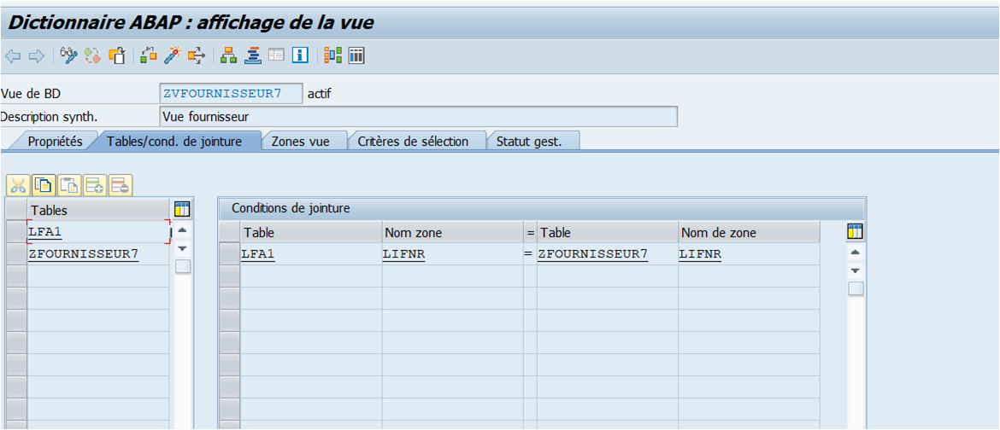

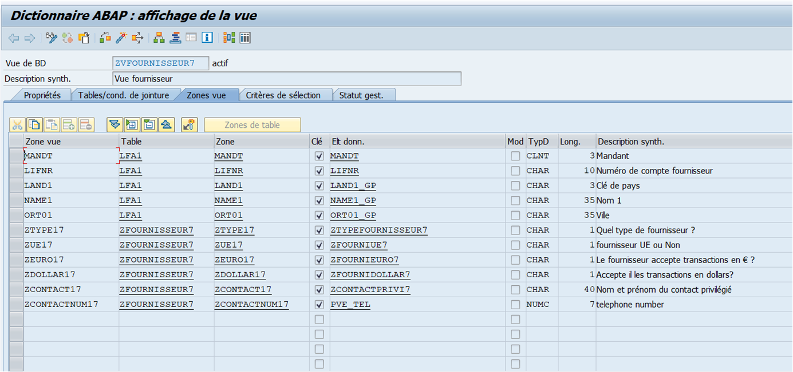

Une `vue` est une `jointure` entre [TABLES](./02_TABLES.md). Elle récupère les données issues des [TABLES](./02_TABLES.md) jointes mais ne les stockes pas de base.

## TYPES DE VUES

Le tableau ci-dessous décrit les 4 types de vues :

| **TYPE DE VUE** | **NBR DE TABLES MAXIMUM** | **MODE DE GESTION**      | **CREATION DANS LA BDD** |
| --------------- | ------------------------- | ------------------------ | ------------------------ |
| Base de données | Pas de limite             | Affichage uniquement[^1] | OUI                      |
| Gestion         | Pas de limite             | Tous les modes           | NON                      |
| Aide            | Pas de limite             | Affichage uniquement     | NON                      |
| Projection      | 1                         | Tous les modes           | NON                      |

## VUE DE MAINTENANCE

Les `vues de maintenance` permettent une approche orientée métier de l'examen des données, tout en permettant en même temps de maintenir les données concernées. Les données de plusieurs [TABLES](./02_TABLES.md) peuvent être résumées dans une `vue de maintenance` et gérées collectivement via cette `vue`. C'est-à-dire que les données sont saisies via la `vue`, puis distribuées aux [TABLES](./02_TABLES.md) sous-jacentes par le système.

## VUE DE LA BASE DE DONNEES (SE11)

Les `vues de base de données` implémentent une `jointure interne`, c'est-à-dire que seuls les enregistrements de la [TABLE](./02_TABLES.md) primaire (sélectionnés via l'opération de jointure) pour lesquels les enregistrements correspondants des [TABLE](./02_TABLES.md) secondaires existent également sont récupérés. Des incohérences entre la [TABLE](./02_TABLES.md) primaire et la [TABLE](./02_TABLES.md) secondaire pourraient donc conduire à un jeu de sélection réduit.

Dans les `vues de base de données`, les conditions de `jointure` peuvent être formulées à l'aide de relations d'égalité entre tous les [CHAMPS DE BASE](../07_DDIC/03_CHAMPS.md). Dans les autres types de `vue`, elles doivent être extraites de [CLES ETRANGERES](./02_TABLES.md) existantes. C'est-à-dire que les tables ne peuvent être collectées dans une `vue de maintenance` ou d'aide que si elles sont liées les unes aux autres via des [CLES ETRANGERES](./02_TABLES.md).

## VUE D'AIDE (SE54)

Les `vues d'aide` sont utilisées pour afficher des informations supplémentaires lorsque le système d'aide en ligne est appelé.
Lorsque le `bouton F4` est enfoncé pour un `champ d'écran`, une vérification est d'abord effectuée pour savoir si un [MATCH-CODE](./07_AIDE_A_LA_RECHERCHE.md) est défini pour ce [CHAMP](../07_DDIC/03_CHAMPS.md). Si ce n'est pas le cas, la `vue d'aide` s'affiche dans laquelle la table de contrôle du [CHAMP](../07_DDIC/03_CHAMPS.md) est la [TABLE](./02_TABLES.md) primaire. Ainsi, pour chaque [TABLE](./02_TABLES.md), il n'est pas possible de créer plus d'une `vue d'aide`, c'est-à-dire qu'une [TABLE](./02_TABLES.md) ne peut être une [TABLE](./02_TABLES.md) principale que dans au plus une `vue d'aide`.

## VUE DE PROJECTION

Les `vues de projection` permettent de supprimer ou de masquer certains [CHAMP](../07_DDIC/03_CHAMPS.md) d'un tableau (projection), minimisant ainsi le nombre d'interfaces. Cela signifie que seules les données réellement nécessaires sont échangées lors de l'accès à la `base de données`.
Une `vue de projection` ne peut s'appuyer que sur une seule [TABLE](./02_TABLES.md). Les conditions de sélection ne peuvent pas être spécifiées pour les `vues de projection`.

## CREATION D'UNE VUE

1. [Transaction SE11](../07_DDIC/02_SE11.md)

      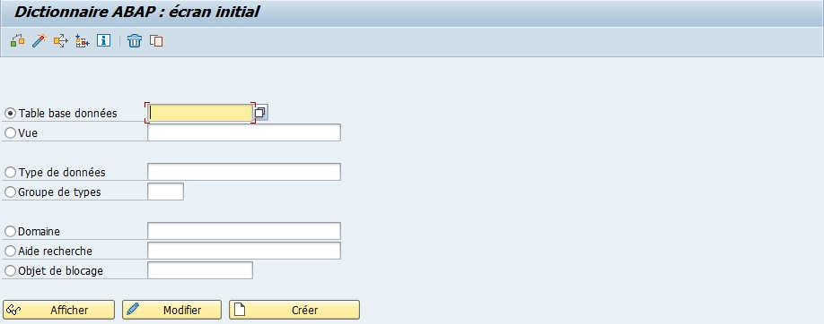

2. `Sélectionner` `Vue`

      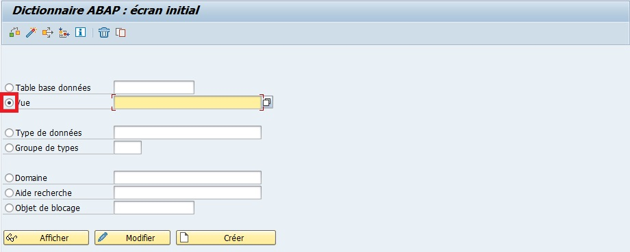

3. `Renseigner` un nom de vue (par exemple ZV_EKKO_EKPO)

      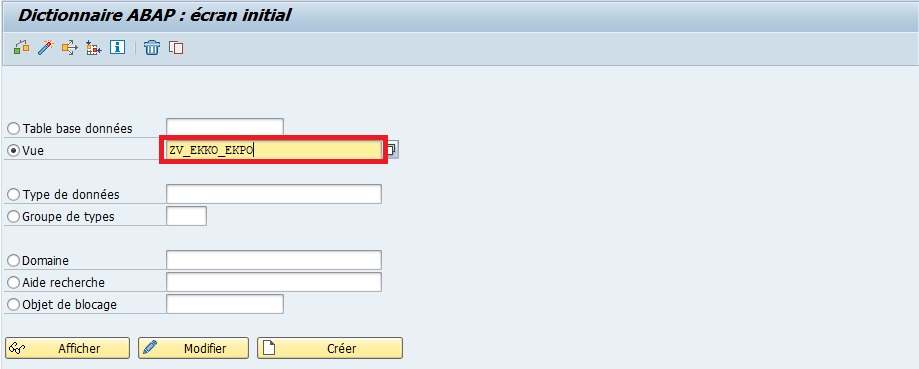

4. `Créer` ou [ F5 ]

      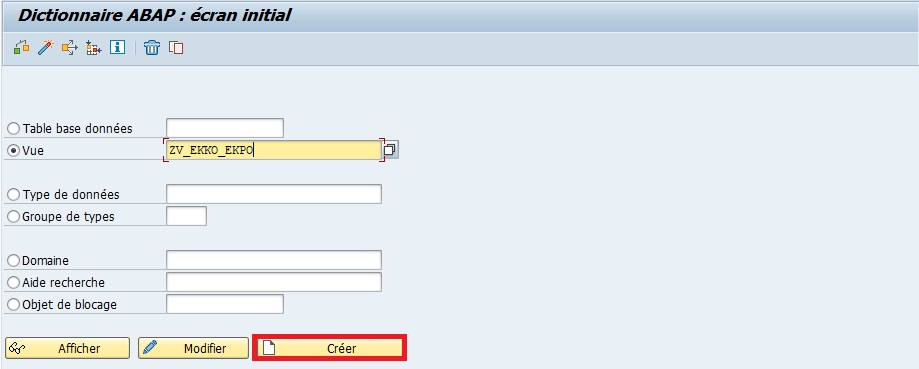

5. `Sélectionner` `Vue de BD` pour une vue de données présentes dans la Base de données

      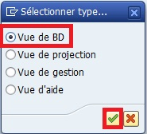

6. `Renseigner` une description (par exemple : Vue pour les tables EKKO et EKPO)

      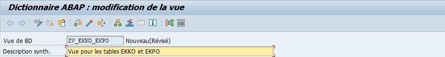

7. Onglet `Tables/Conditions de jointure`

      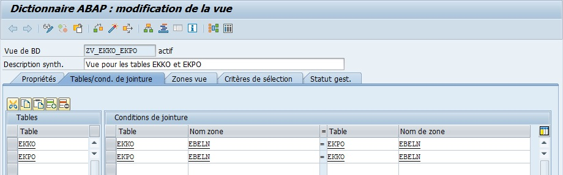

8. Onglet `Zones vue`

      

9. `Sauvegarder` et `Activer`

      Un message apparaîtra avec l'information suivante :

      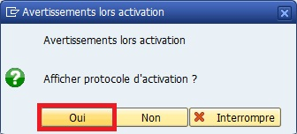

      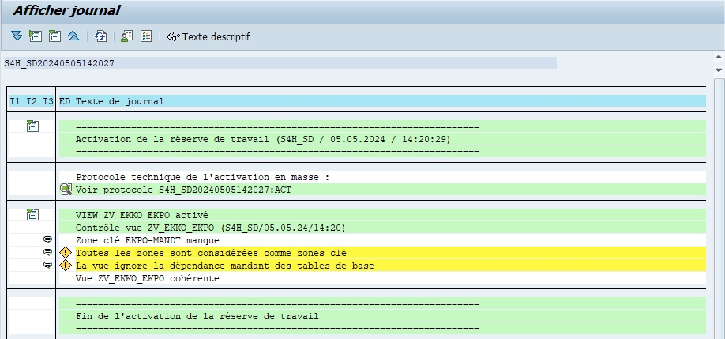

      Le journal rapporte des avertissements concernant les "zones clé" et la dépendance mandant. C'est normal étant donné que la clé unique de la table EKKO (EBELN) se répetera éventuellement autant de fois qu'elle a de poste dans la table EKPO.

10. [Transaction SE16N](./01_SE16N.md)

      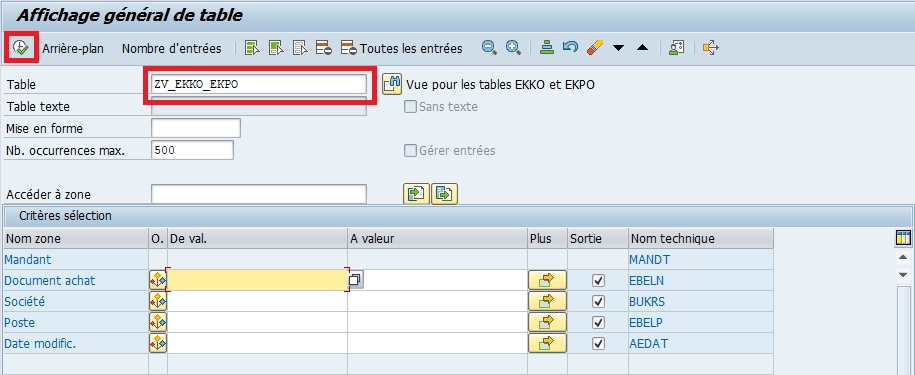

      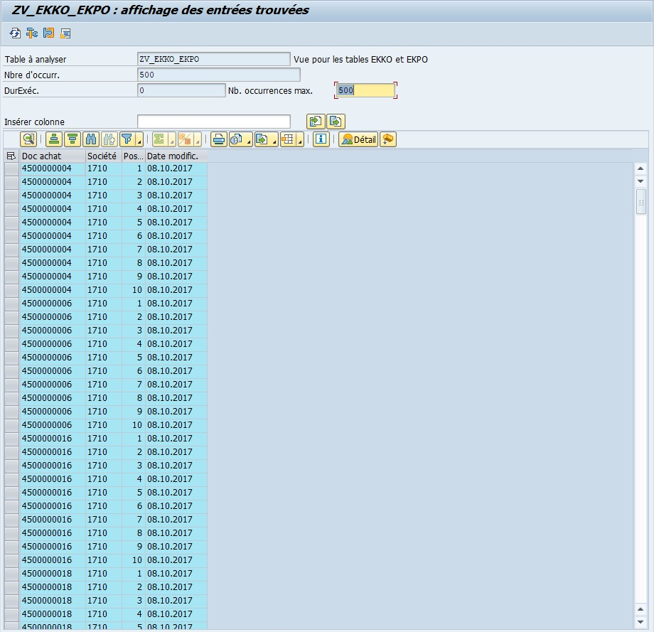

[^1]: Sauf pour les vues constituées d’une seule table. Table virtuelle composée de colonnes d’une ou plusieurs tables. Les relations se font sur les clés primaires des tables.