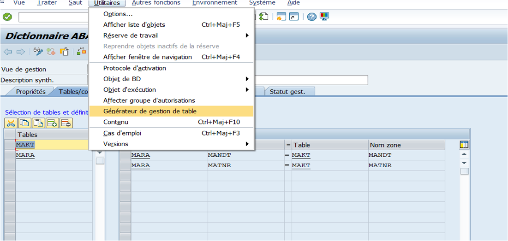
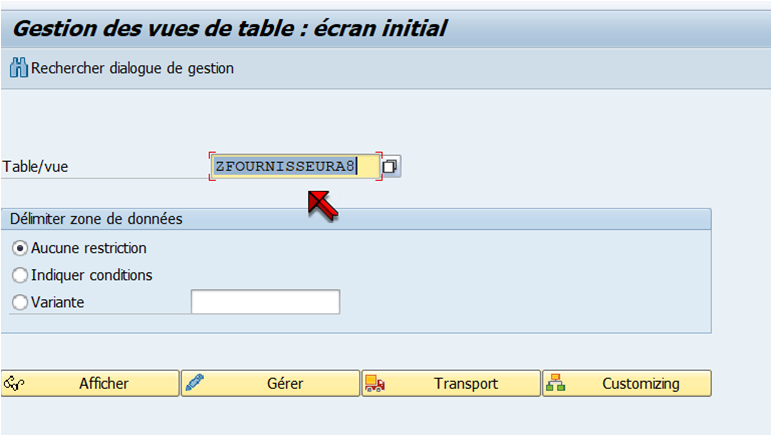
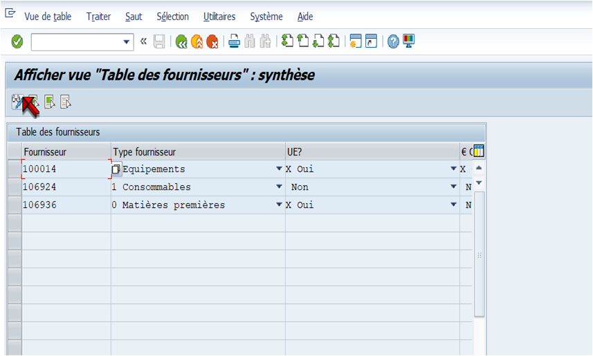
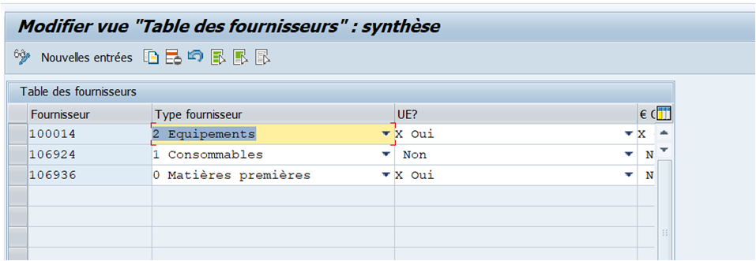

# DIALOGUE DE GESTION

Le `générateur de gestion de table` est un outil qui permet d’afficher et mettre à jour des [TABLES TRANSPARENTES](./02_TABLES.md) sans développer de programme.

Il est proposé dans le dictionnaire au niveau des [TABLES](./02_TABLES.md) et des [VUES](./05_VUES.md). L’avantage d’un dialogue généré au niveau d’une [VUE](./05_VUES.md) est la possibilité de mixer la gestion des [CHAMPS](../07_DDIC/03_CHAMPS.md) : mise à jour, affichage, masquage de certaines [ZONES](../07_DDIC/03_CHAMPS.md)… Ces options se définissent au moment de la création de la [VUES](./05_VUES.md).

## GENERATION D'UN DIALOGUE DE GESTION

### PRE-REQUIS

- `Groupe de fonction` :

  Il est recommandé de créer un `groupe de fonction` spécifique pour les `dialogues de gestion`, car SAP va générer un ensemble de `modules fonction` qui pourront être modifiés ou supprimés suivant l’évolution du dialogue. Pour pouvoir créer un `dialogue de gestion` avec des tables spécifiques, il ne faut pas oublier de cocher la case `Gestion de table autorisée` lors de la création de la [TABLE](./02_TABLES.md).

  

### UTILISATION

Pour utiliser le `dialogue de gestion` et gérer les [TABLES](./02_TABLES.md)/[VUES](./05_VUES.md), il faut passer par la `transaction SM30` pour les [TABLES SPECIFIQUES](./02_TABLES.md) (SM31 pour les [TABLES STANDARDS](./02_TABLES.md)) :

  

  

### MODIFICATION

Une fois passé en modification, vous pourrez ajouter des nouvelles entrées dans la [table](./08_TABLES.md), modifier les entrées existantes ou en supprimer.

  
