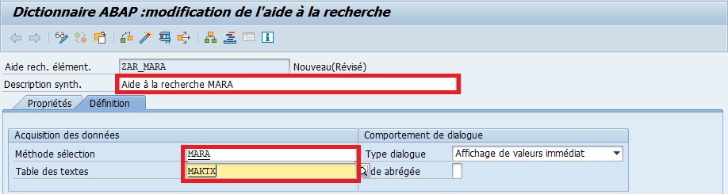

# AIDE A LA RECHERCHE

Les `aides à la recherche` sont les aides à la saisie sur les [CHAMPS](../07_DDIC/03_CHAMPS.md). Ils sont des listes de valeur affichées directement ou après sélection de [CHAMPS](../07_DDIC/03_CHAMPS.md). En outre, beaucoup d’`aides à la recherche` sont fournies en standard et lorsque l’on crée une `aide à la recherche`, il faut se baser sur une [TABLE](./0Z_TABLES.md) ou une [VUE](./05_VUES.mdd) de référence. Il faudra ensuite préciser le `type de dialogue` :

- `Affichage de valeurs immédiat` :

  Liste affichée immédiatement après l’appel de l’aide . Conseillé lorsqu’il y a peu de valeurs.

- `Dialogue complexe avec délimitation de valeurs` :

  Une boite de dialogue apparaît qui permet de délimiter la liste des valeurs à afficher.

- `Dialogue dépendant du jeu de valeurs` :

  C’est le système qui détermine l’affichage, s’il y a moins de 100 occurrences, affichage immédiat, sinon affichage de la boite de dialogue.

## CREATION D'UNE AIDE A LA RECHERCHE POUR LA TABLE MARA

1. [Transaction SE11](../07_DDIC/02_SE11.md).

      

2. `Cocher` l’option `Aide recherche`.

      

3. `Entrer` le nom `ZAR_MARA` ("AR" pour Aide à la Recherche).

      

4. `Sélectionner` l'option `Aide recherche élémentaire`.

      

5. `Entrer` une `description` (obligatoire) (exemple `Aide MARA`).

      

6. `Renseigner` la description, la `Méthode sélection` et `Table des textes`.

      

   - Description : Aide à la recherche MARA

   - Méthode sélection : MARA

   - Table des textes : MAKTX

7. `Sélectionner` l'option `Affichage de valeurs immédiat` (Type de dialogue).

      

   Cette aide à la recherche affichera les champs :

   - `MATNR` (n° d’article) qui sera à la fois un champ d’`import` et d’`export`
   - `MAKTX` (désignation de l’article)
   - `MTART` (type d’article)
   - `MATKL` (groupe marchandise)

   Les paramètres ressembleront à ceci :

      

   | CHAMP   | IMP | EXP | PosL | PAR. | Elmt données |
   | ------- | --- | --- | ---- | ---- | ------------ |
   | `MATNR` | X   | X   | 1    | 1    | MATNR        |
   | `MAKTX` |     |     | 2    | 2    | MAKTX        |
   | `MTART` |     |     | 3    | 3    | MTART        |
   | `MATKL` |     |     | 4    | 4    | MATKL        |

8. `Sauvegarder`.

      

      

9. `Contrôler`.

      

      

10. `Activer`.

      

      

      

    Il est également possible de la tester avec le bouton Tester... de la barre d’outils, via le raccourci-clavier [F8] ou par le menu déroulant.
