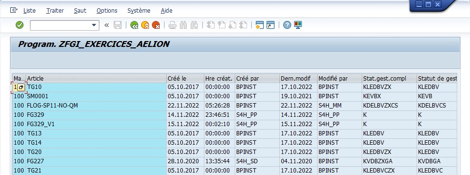
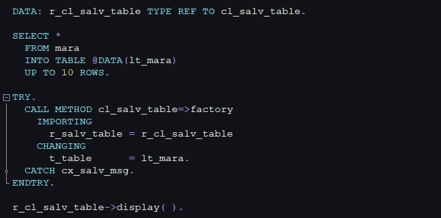

# ALV

Un `ALV` (ABAP List Viewer) sur SAP est un outil utilisé pour afficher des listes et des tables de données de manière claire et structurée. Il permet de présenter les données de façon interactive, avec la possibilité d'ajouter des fonctionnalités comme le tri, le filtrage, la somme, et l'exportation des données.



## EXEMPLE IMPLEMENTATION

Pour l'exemple, nous utiliseront une version simple d'affichage avec la méthode `FACTORY` de la classe `CL_SALV_TABLE`. Les notions de classes et méthodes seront abordées plus tard, dans la suite de la formation.

Dans l'exemple ci-dessous, une table locale a été créée de manière dynamique (`@DATA(lt_mara)`) dans l'instruction `SELECT` afin de stocker des données à afficher. Ce sera cette table qui sera destinée a être affichée.

Lors de l'exécution du programme, la méthode `FACTORY` de la classe `CL_SALV_TABLE` se chargera d'afficher la table `lt_mara`.



## IMPLEMENTATION

> Pour utiliser cette méthode/classe, copier le code ci-dessous et remplacer `lt_xxxxx` par la table que vous voulez afficher. La table devra préalablement être déclarée et alimentée en amont de ce snippet.

```abap
DATA: r_salv_table TYPE REF TO cl_salv_table.

TRY.
  CALL METHOD cl_salv_table=>factory
    IMPORTING
      r_salv_table = r_salv_table
    CHANGING
      t_table      = lt_xxxxx. "remplacer lt_xxxxx par le nom de votre table
  CATCH cx_salv_msg.
ENDTRY.

r_salv_table->display( ).
```

> Après avoir modifié `lt_xxxxx` par la table que vous voulez afficher, exécuter le programme.